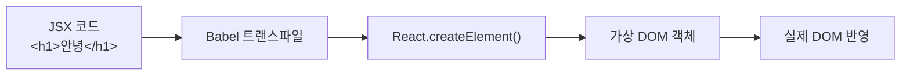
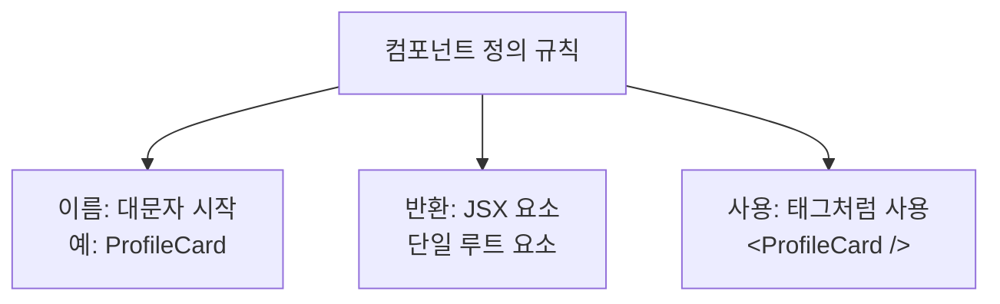
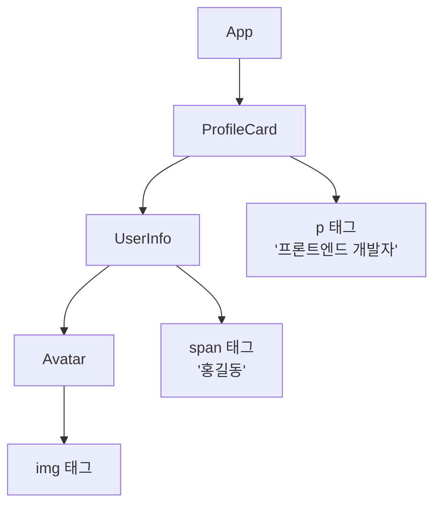

# 챕터 01: JSX와 컴포넌트

> **난이도**: ⭐ (1/5)
> **예상 학습 시간**: 1.5시간
> **선수 지식**: HTML, CSS 기초, JavaScript ES6 기초 (화살표 함수, 템플릿 리터럴)

---

## 학습 목표

이 챕터를 마치면 다음을 할 수 있습니다:

- JSX 문법의 규칙을 이해하고 올바르게 작성할 수 있습니다
- 함수형 컴포넌트를 정의하고 사용할 수 있습니다
- 컴포넌트를 중첩하여 컴포넌트 트리를 구성할 수 있습니다
- JSX 내에서 JavaScript 표현식을 활용할 수 있습니다

---

## 핵심 개념

### 1. JSX란 무엇인가?

JSX(JavaScript XML)는 JavaScript 안에서 HTML과 유사한 문법을 사용할 수 있게 해주는 **문법 확장**입니다. React에서 UI를 선언적으로 표현하기 위해 사용합니다.

JSX는 브라우저가 직접 이해할 수 없으므로, Babel 같은 트랜스파일러가 `React.createElement()` 호출로 변환합니다.

```jsx
// JSX 코드
const element = <h1 className="title">안녕하세요!</h1>;

// 변환된 JavaScript 코드
const element = React.createElement('h1', { className: 'title' }, '안녕하세요!');
```



### 2. JSX 문법 규칙

JSX를 올바르게 작성하려면 몇 가지 규칙을 알아야 합니다:

#### 규칙 1: 단일 루트 요소
JSX는 반드시 **하나의 루트 요소**로 감싸야 합니다.

```jsx
// 잘못된 예시
return (
  <h1>제목</h1>
  <p>내용</p>
);

// 올바른 예시 1: div로 감싸기
return (
  <div>
    <h1>제목</h1>
    <p>내용</p>
  </div>
);

// 올바른 예시 2: Fragment 사용 (불필요한 DOM 노드 방지)
return (
  <>
    <h1>제목</h1>
    <p>내용</p>
  </>
);
```

#### 규칙 2: 모든 태그는 닫아야 함
HTML에서는 `<br>`, `` 같은 태그를 닫지 않아도 되지만, JSX에서는 반드시 닫아야 합니다.

```jsx
// 잘못된 예시

<br>

// 올바른 예시

<br />
```

#### 규칙 3: HTML 속성명 차이
JSX는 JavaScript이므로 일부 속성명이 다릅니다.

| HTML | JSX | 이유 |
|------|-----|------|
| `class` | `className` | `class`는 JS 예약어 |
| `for` | `htmlFor` | `for`는 JS 예약어 |
| `tabindex` | `tabIndex` | camelCase 규칙 |
| `onclick` | `onClick` | camelCase 규칙 |

#### 규칙 4: JavaScript 표현식 사용
중괄호 `{}`를 사용하여 JSX 안에 JavaScript 표현식을 삽입할 수 있습니다.

```jsx
const name = "React";
const year = 2024;

return (
  <div>
    <h1>{name} 학습</h1>
    <p>올해는 {year}년입니다</p>
    <p>{2 + 3}은 5입니다</p>
    <p>{name.toUpperCase()}</p>
  </div>
);
```

### 3. 함수형 컴포넌트

React 컴포넌트는 **UI의 독립적이고 재사용 가능한 조각**입니다. 함수형 컴포넌트는 JSX를 반환하는 JavaScript 함수입니다.

```jsx
// 함수형 컴포넌트 정의
function Greeting() {
  return <h1>안녕하세요!</h1>;
}

// 화살표 함수로도 정의 가능
const Greeting = () => {
  return <h1>안녕하세요!</h1>;
};

// 컴포넌트 사용
function App() {
  return (
    <div>
      <Greeting />
    </div>
  );
}
```

> **중요**: 컴포넌트 이름은 반드시 **대문자로 시작**해야 합니다. 소문자로 시작하면 React는 이를 HTML 태그로 인식합니다.



### 4. 컴포넌트 중첩과 컴포넌트 트리

컴포넌트는 다른 컴포넌트를 포함할 수 있습니다. 이를 **컴포넌트 중첩**이라 하며, 이렇게 구성된 계층 구조를 **컴포넌트 트리**라고 합니다.

```jsx
function Avatar() {
  return ;
}

function UserInfo() {
  return (
    <div className="user-info">
      <Avatar />
      <span>홍길동</span>
    </div>
  );
}

function ProfileCard() {
  return (
    <div className="profile-card">
      <UserInfo />
      <p>프론트엔드 개발자</p>
    </div>
  );
}

function App() {
  return (
    <div className="app">
      <ProfileCard />
    </div>
  );
}
```

위 코드의 컴포넌트 트리:



---

## 코드로 이해하기

### 예제 1: 프로필 카드 컴포넌트
> 파일: `practice/example-01.jsx` 파일을 참고하세요.

```jsx
function ProfileCard() {
  const name = "김리액트";
  const role = "프론트엔드 개발자";
  const skills = ["React", "TypeScript", "Next.js"];

  return (
    <div className="profile-card">
      <div className="profile-header">
        
        <h2 className="profile-name">{name}</h2>
        <p className="profile-role">{role}</p>
      </div>
      <div className="profile-skills">
        <h3>기술 스택</h3>
        <p>{skills.join(", ")}</p>
      </div>
    </div>
  );
}
```

**실행 방법**:
```bash
# 프로젝트 생성 (최초 1회)
npx create-react-app ch01-demo
cd ch01-demo

# src/App.js를 example-01.jsx 내용으로 교체 후
npm start
```

**예상 출력**: 프로필 사진, 이름, 역할, 기술 스택이 표시된 카드 UI

### 예제 2: 컴포넌트 분리와 조합
> 파일: `practice/example-02.jsx` 파일을 참고하세요.

```jsx
function Header() {
  return (
    <header>
      <h1>나의 포트폴리오</h1>
      <nav>
        <a href="#about">소개</a>
        <a href="#projects">프로젝트</a>
        <a href="#contact">연락처</a>
      </nav>
    </header>
  );
}

function App() {
  return (
    <>
      <Header />
      <main>
        <ProfileCard />
      </main>
      <Footer />
    </>
  );
}
```

---

## 주의 사항

- **JSX에서 `class` 대신 `className`을 사용하세요.** `class`는 JavaScript의 예약어이기 때문입니다.
- **컴포넌트 이름은 반드시 대문자로 시작해야 합니다.** `profileCard`(X) -> `ProfileCard`(O)
- **JSX 중괄호 안에는 표현식만 가능합니다.** `if`문, `for`문 같은 문(statement)은 사용할 수 없습니다.
- **인라인 스타일은 객체로 전달합니다.** `style="color: red"` 대신 `style={{ color: 'red' }}`를 사용합니다.
- **Fragment(`<>...</>`)를 활용하면** 불필요한 DOM 노드 생성을 방지할 수 있습니다.

---

## 정리

| 개념 | 설명 | 예제 |
|------|------|------|
| JSX | JavaScript 안에서 HTML 유사 문법 사용 | `<h1>안녕</h1>` |
| 중괄호 표현식 | JSX 내 JS 값 삽입 | `{name}`, `{2+3}` |
| 함수형 컴포넌트 | JSX를 반환하는 함수 | `function Card() { return <div>...</div> }` |
| 컴포넌트 중첩 | 컴포넌트 안에 컴포넌트 사용 | `<Card><Avatar /></Card>` |
| Fragment | 불필요한 래퍼 없이 여러 요소 반환 | `<>...</>` |
| className | JSX에서 CSS 클래스 지정 | `<div className="box">` |

---

## 다음 단계

- `practice/exercise.md`의 연습 문제를 풀어보세요.
- 다음 챕터: **챕터 02 - Props와 데이터 흐름**
- 참고 자료:
  - [React 공식 문서 - JSX 소개](https://react.dev/learn/writing-markup-with-jsx)
  - [React 공식 문서 - 첫 번째 컴포넌트](https://react.dev/learn/your-first-component)
