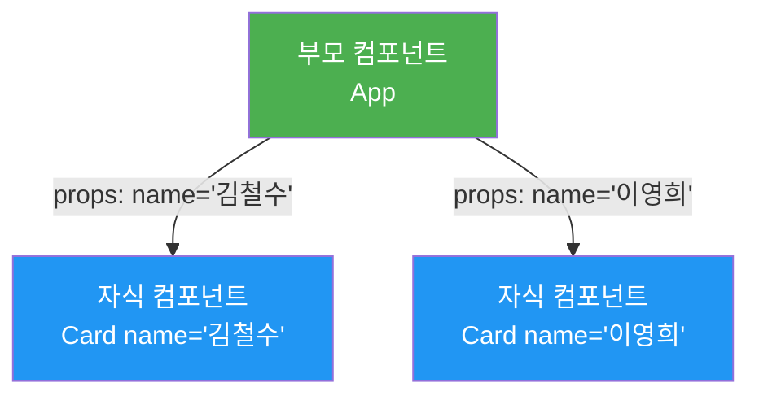
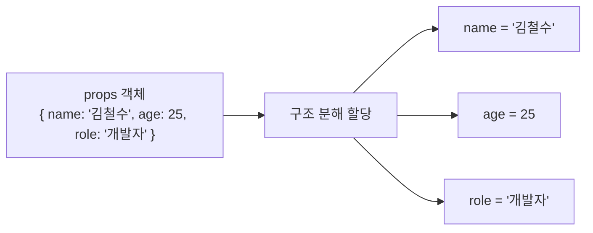
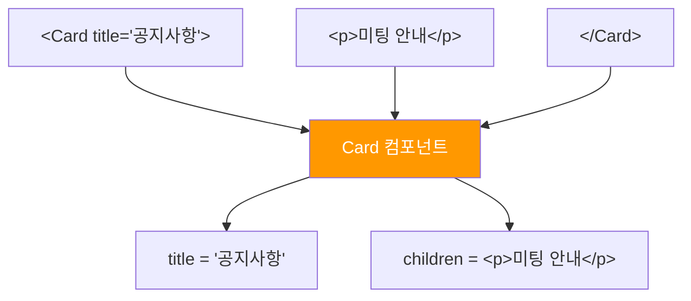
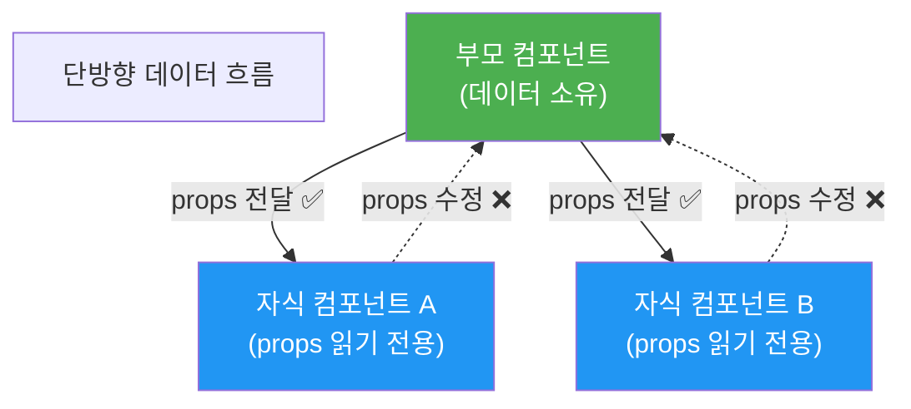

# 챕터 02: Props와 데이터 흐름

> **난이도**: ⭐ (1/5)
> **예상 학습 시간**: 1.5시간
> **선수 지식**: 챕터 01 (JSX와 컴포넌트)

---

## 학습 목표

이 챕터를 마치면 다음을 할 수 있습니다:

- props를 통해 부모에서 자식 컴포넌트로 데이터를 전달할 수 있습니다
- 구조 분해 할당으로 props를 깔끔하게 받을 수 있습니다
- children prop을 활용하여 유연한 레이아웃 컴포넌트를 만들 수 있습니다
- defaultProps와 기본값 설정으로 안전한 컴포넌트를 설계할 수 있습니다

---

## 핵심 개념

### 1. Props란 무엇인가?

Props(Properties)는 **부모 컴포넌트가 자식 컴포넌트에 전달하는 데이터**입니다. 함수의 매개변수와 비슷한 역할을 합니다.

챕터 01에서 만든 컴포넌트들은 항상 같은 내용을 보여줬습니다. Props를 사용하면 **같은 컴포넌트를 다른 데이터로 재사용**할 수 있습니다.



```jsx
// 부모 컴포넌트에서 props 전달
function App() {
  return (
    <div>
      <Greeting name="김철수" />
      <Greeting name="이영희" />
    </div>
  );
}

// 자식 컴포넌트에서 props 받기
function Greeting(props) {
  return <h1>{props.name}님, 안녕하세요!</h1>;
}
```

### 2. 구조 분해 할당으로 Props 받기

`props.name`, `props.age`처럼 매번 `props.`를 쓰는 것은 번거롭습니다. **구조 분해 할당**을 사용하면 더 깔끔하게 작성할 수 있습니다.

```jsx
// 방법 1: props 객체 사용
function UserCard(props) {
  return (
    <div>
      <h2>{props.name}</h2>
      <p>{props.age}세</p>
      <p>{props.role}</p>
    </div>
  );
}

// 방법 2: 구조 분해 할당 (권장)
function UserCard({ name, age, role }) {
  return (
    <div>
      <h2>{name}</h2>
      <p>{age}세</p>
      <p>{role}</p>
    </div>
  );
}
```



### 3. 다양한 타입의 Props 전달

Props로는 문자열, 숫자, 불리언, 배열, 객체, 함수 등 **모든 JavaScript 값**을 전달할 수 있습니다.

```jsx
function App() {
  const user = { name: "김리액트", age: 25 };

  return (
    <Profile
      name="김리액트"        {/* 문자열 */}
      age={25}               {/* 숫자 */}
      isActive={true}        {/* 불리언 */}
      skills={["React", "JS"]} {/* 배열 */}
      user={user}            {/* 객체 */}
      onGreet={() => alert("안녕!")} {/* 함수 */}
    />
  );
}
```

> **주의**: 문자열을 제외한 모든 값은 중괄호 `{}`로 감싸야 합니다.

### 4. children Prop

`children`은 특별한 prop으로, **컴포넌트 태그 사이에 넣은 내용**을 자동으로 받습니다. 이를 통해 유연한 레이아웃 컴포넌트를 만들 수 있습니다.

```jsx
// children을 받는 Card 컴포넌트
function Card({ title, children }) {
  return (
    <div className="card">
      <h2>{title}</h2>
      <div className="card-body">
        {children}  {/* 태그 사이의 내용이 여기에 들어감 */}
      </div>
    </div>
  );
}

// 사용: 태그 사이에 다양한 내용을 넣을 수 있음
function App() {
  return (
    <div>
      <Card title="공지사항">
        <p>이번 주 금요일에 미팅이 있습니다.</p>
      </Card>

      <Card title="프로필">
        
        <p>김리액트</p>
      </Card>
    </div>
  );
}
```



### 5. 기본값 설정 (Default Props)

props가 전달되지 않았을 때 사용할 **기본값**을 설정할 수 있습니다.

```jsx
// 방법 1: 매개변수 기본값 (권장)
function Button({ text = "클릭", color = "blue", size = "medium" }) {
  return (
    <button style={{ backgroundColor: color }} className={`btn-${size}`}>
      {text}
    </button>
  );
}

// 사용
<Button />                          // text="클릭", color="blue", size="medium"
<Button text="저장" />              // text="저장", color="blue", size="medium"
<Button text="삭제" color="red" />  // text="삭제", color="red", size="medium"
```

### 6. Props는 읽기 전용

**Props는 절대 수정하면 안 됩니다.** React에서 데이터는 항상 부모에서 자식으로 흐르며(단방향 데이터 흐름), 자식은 받은 props를 변경할 수 없습니다.

```jsx
// 잘못된 예시 - props를 직접 수정
function BadComponent({ count }) {
  count = count + 1; // 이러면 안 됩니다!
  return <p>{count}</p>;
}

// 올바른 예시 - props를 읽기만 함
function GoodComponent({ count }) {
  return <p>{count + 1}</p>; // 표현식으로 계산만 함
}
```



---

## 코드로 이해하기

### 예제 1: 재사용 가능한 Button과 Card 컴포넌트
> 파일: `practice/example-01.jsx` 파일을 참고하세요.

```jsx
function Button({ text = "클릭", variant = "primary", onClick }) {
  const styles = {
    primary: { backgroundColor: "#2563eb", color: "#fff" },
    secondary: { backgroundColor: "#6b7280", color: "#fff" },
    danger: { backgroundColor: "#dc2626", color: "#fff" },
  };

  return (
    <button style={styles[variant]} onClick={onClick}>
      {text}
    </button>
  );
}
```

**실행 방법**:
```bash
npx create-react-app ch02-demo
cd ch02-demo
# src/App.js를 example-01.jsx 내용으로 교체
npm start
```

**예상 출력**: 다양한 스타일의 버튼과 카드 컴포넌트가 화면에 표시됩니다.

### 예제 2: children을 활용한 레이아웃 컴포넌트
> 파일: `practice/example-02.jsx` 파일을 참고하세요.

```jsx
function PageLayout({ children }) {
  return (
    <div className="layout">
      <Header />
      <main>{children}</main>
      <Footer />
    </div>
  );
}
```

---

## 주의 사항

- **Props 이름은 camelCase**를 사용하세요: `backgroundColor` (O), `background-color` (X)
- **불리언 props는 이름만 써도 `true`입니다**: `<Button disabled />` === `<Button disabled={true} />`
- **props를 직접 수정하지 마세요.** React의 단방향 데이터 흐름을 지켜야 합니다.
- **props가 많아지면 객체로 묶어서 전달**하는 것을 고려하세요.
- **spread 연산자 남용에 주의하세요**: `<Component {...props} />`는 편리하지만 어떤 props가 전달되는지 파악하기 어렵습니다.

---

## 정리

| 개념 | 설명 | 예제 |
|------|------|------|
| props | 부모→자식 데이터 전달 | `<Card name="리액트" />` |
| 구조 분해 | props를 개별 변수로 추출 | `function Card({ name })` |
| children | 태그 사이의 내용을 받는 특수 prop | `<Card>내용</Card>` |
| 기본값 | props 미전달 시 사용할 값 | `{ name = "기본" }` |
| 읽기 전용 | props는 수정 불가 | 단방향 데이터 흐름 |

---

## 다음 단계

- `practice/exercise.md`의 연습 문제를 풀어보세요.
- 다음 챕터: **챕터 03 - State와 이벤트**
- 참고 자료:
  - [React 공식 문서 - Props 전달](https://react.dev/learn/passing-props-to-a-component)
  - [React 공식 문서 - 컴포넌트에 Props 전달하기](https://react.dev/learn/passing-props-to-a-component#passing-jsx-as-children)
