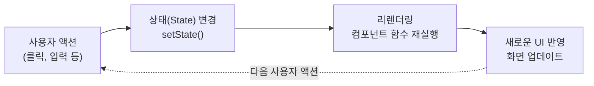
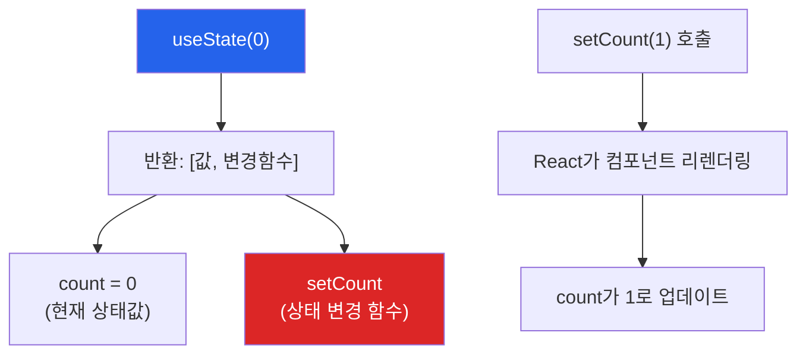
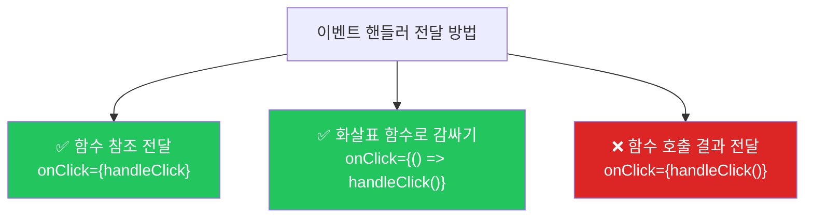
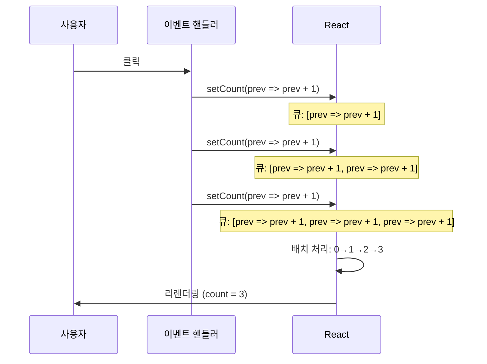

# 챕터 03: State와 이벤트

> **난이도**: ⭐⭐ (2/5)
> **예상 학습 시간**: 2시간
> **선수 지식**: 챕터 01 (JSX와 컴포넌트), 챕터 02 (Props와 데이터 흐름)

---

## 학습 목표

이 챕터를 마치면 다음을 할 수 있습니다:

- useState Hook을 사용하여 컴포넌트의 상태를 관리할 수 있습니다
- 이벤트 핸들러를 올바르게 작성하고 연결할 수 있습니다
- 상태 업데이트가 리렌더링을 일으키는 원리를 이해할 수 있습니다
- 이전 상태에 기반한 업데이트를 안전하게 수행할 수 있습니다

---

## 핵심 개념

### 1. State란 무엇인가?

**State(상태)**는 컴포넌트 내부에서 관리하는 **변경 가능한 데이터**입니다. Props가 외부에서 전달받는 읽기 전용 데이터라면, State는 컴포넌트 스스로가 소유하고 변경할 수 있는 데이터입니다.

State가 변경되면 React는 해당 컴포넌트를 **자동으로 다시 렌더링(리렌더링)**합니다.



#### 일반 변수 vs State

```jsx
// 일반 변수: 변경해도 화면이 업데이트되지 않음
function BrokenCounter() {
  let count = 0;

  function handleClick() {
    count = count + 1; // 값은 바뀌지만 화면에 반영 안 됨!
    console.log(count); // 콘솔에는 찍히지만...
  }

  return <button onClick={handleClick}>클릭: {count}</button>;
  // 항상 "클릭: 0"으로 표시됨
}
```

```jsx
// useState: 변경 시 화면이 자동 업데이트됨
import { useState } from "react";

function WorkingCounter() {
  const [count, setCount] = useState(0);

  function handleClick() {
    setCount(count + 1); // 상태 변경 -> 리렌더링 -> 화면 업데이트!
  }

  return <button onClick={handleClick}>클릭: {count}</button>;
  // 클릭할 때마다 숫자가 증가함
}
```

### 2. useState Hook

`useState`는 React에서 가장 기본적인 Hook입니다. 컴포넌트에 상태를 추가할 때 사용합니다.

```jsx
const [상태값, 상태변경함수] = useState(초기값);
```



#### useState의 규칙

1. **컴포넌트 최상위 레벨**에서만 호출해야 합니다
2. **조건문, 반복문, 중첩 함수 안**에서 호출하면 안 됩니다
3. **React 함수형 컴포넌트** 안에서만 사용할 수 있습니다

```jsx
// 올바른 사용
function MyComponent() {
  const [name, setName] = useState(""); // 최상위 레벨

  // ...
}

// 잘못된 사용
function MyComponent() {
  if (true) {
    const [name, setName] = useState(""); // 조건문 안 - 오류!
  }
}
```

### 3. 이벤트 핸들러

React에서 이벤트를 처리하는 방법입니다. HTML과 비슷하지만 몇 가지 차이점이 있습니다.

```jsx
function EventExamples() {
  const [text, setText] = useState("");

  // 이벤트 핸들러 함수
  const handleClick = () => {
    alert("버튼이 클릭되었습니다!");
  };

  const handleChange = (event) => {
    setText(event.target.value);
  };

  const handleSubmit = (event) => {
    event.preventDefault(); // 폼 기본 동작 방지
    alert(`입력값: ${text}`);
  };

  return (
    <form onSubmit={handleSubmit}>
      {/* onClick: 클릭 이벤트 */}
      <button onClick={handleClick}>클릭</button>

      {/* onChange: 입력 변경 이벤트 */}
      <input value={text} onChange={handleChange} />

      {/* onSubmit: 폼 제출 이벤트 */}
      <button type="submit">제출</button>
    </form>
  );
}
```

#### 이벤트 핸들러 주의점

```jsx
// 올바른 방법: 함수를 전달
<button onClick={handleClick}>클릭</button>
<button onClick={() => setCount(count + 1)}>클릭</button>

// 잘못된 방법: 함수를 호출 (렌더링 시 즉시 실행됨!)
<button onClick={handleClick()}>클릭</button>  // 오류!
<button onClick={setCount(count + 1)}>클릭</button>  // 오류!
```



### 4. 상태 업데이트와 리렌더링

#### 배치(Batch) 업데이트

React는 성능을 위해 여러 상태 업데이트를 **하나로 모아서(배치)** 처리합니다.

```jsx
function BatchExample() {
  const [count, setCount] = useState(0);

  const handleClick = () => {
    // 이 세 줄이 각각 리렌더링을 일으키는 게 아니라,
    // 모두 처리된 후 한 번만 리렌더링됩니다.
    setCount(count + 1);
    setCount(count + 1);
    setCount(count + 1);
    // 결과: count는 0 + 1 = 1 (3이 아님!)
    // 왜? 세 줄 모두 같은 "count(0)" 값을 참조하기 때문
  };
}
```

#### 함수형 업데이트 (이전 상태 기반)

이전 상태값에 기반하여 업데이트할 때는 **함수형 업데이트**를 사용해야 합니다.

```jsx
function CorrectBatchExample() {
  const [count, setCount] = useState(0);

  const handleClick = () => {
    // 함수형 업데이트: 이전 값을 인자로 받음
    setCount((prev) => prev + 1); // 0 -> 1
    setCount((prev) => prev + 1); // 1 -> 2
    setCount((prev) => prev + 1); // 2 -> 3
    // 결과: count = 3 (올바르게 동작!)
  };
}
```



### 5. 객체/배열 상태 업데이트

State가 객체나 배열일 때는 **불변성(Immutability)**을 지켜야 합니다. 직접 수정하지 말고 **새 객체/배열을 만들어** 전달하세요.

```jsx
function ProfileForm() {
  const [user, setUser] = useState({
    name: "",
    email: "",
    age: 0,
  });

  // 잘못된 방법: 직접 수정
  const handleBad = () => {
    user.name = "김리액트"; // 직접 수정 - 리렌더링 안 됨!
    setUser(user);          // 같은 참조이므로 React가 변경을 감지 못 함
  };

  // 올바른 방법: 새 객체 생성 (spread 연산자)
  const handleGood = () => {
    setUser({
      ...user,              // 기존 값 복사
      name: "김리액트",      // 변경할 값만 덮어쓰기
    });
  };
}
```

---

## 코드로 이해하기

### 예제 1: 카운터 앱과 토글 UI
> 파일: `practice/example-01.jsx` 파일을 참고하세요.

```jsx
function Counter() {
  const [count, setCount] = useState(0);

  return (
    <div>
      <p>카운트: {count}</p>
      <button onClick={() => setCount(count + 1)}>+1</button>
      <button onClick={() => setCount(count - 1)}>-1</button>
      <button onClick={() => setCount(0)}>초기화</button>
    </div>
  );
}
```

**실행 방법**:
```bash
npx create-react-app ch03-demo
cd ch03-demo
# src/App.js를 example-01.jsx 내용으로 교체
npm start
```

**예상 출력**: +1, -1, 초기화 버튼이 있는 카운터와 다크모드 토글 UI

### 예제 2: 폼 입력과 객체 상태 관리
> 파일: `practice/example-02.jsx` 파일을 참고하세요.

```jsx
function SimpleForm() {
  const [formData, setFormData] = useState({
    name: "",
    email: "",
  });

  const handleChange = (event) => {
    const { name, value } = event.target;
    setFormData((prev) => ({ ...prev, [name]: value }));
  };
}
```

---

## 주의 사항

- **일반 변수를 상태 대신 사용하지 마세요.** `let count = 0` 으로는 화면이 업데이트되지 않습니다.
- **이벤트 핸들러에 함수를 "전달"하세요, "호출"하지 마세요.** `onClick={handleClick}` (O), `onClick={handleClick()}` (X)
- **이전 상태에 기반한 업데이트는 함수형 업데이트를 사용하세요.** `setCount(prev => prev + 1)`
- **객체/배열 State는 불변성을 지키세요.** 직접 수정(push, splice 등)하면 안 됩니다.
- **useState는 컴포넌트 최상위 레벨에서만 호출하세요.** 조건문, 반복문 안에서 호출하면 안 됩니다.

---

## 정리

| 개념 | 설명 | 예제 |
|------|------|------|
| useState | 컴포넌트에 상태 추가 | `const [count, setCount] = useState(0)` |
| 이벤트 핸들러 | 사용자 액션에 반응 | `onClick={handleClick}` |
| 리렌더링 | 상태 변경 시 컴포넌트 재실행 | `setCount(1)` -> 리렌더링 |
| 함수형 업데이트 | 이전 상태 기반 업데이트 | `setCount(prev => prev + 1)` |
| 불변성 | 객체/배열을 새로 만들어 전달 | `setUser({...user, name: '새이름'})` |

---

## 다음 단계

- `practice/exercise.md`의 연습 문제를 풀어보세요.
- 다음 챕터: **챕터 04 - 조건부/리스트 렌더링**
- 참고 자료:
  - [React 공식 문서 - State](https://react.dev/learn/state-a-components-memory)
  - [React 공식 문서 - 이벤트 처리](https://react.dev/learn/responding-to-events)
  - [React 공식 문서 - 객체 State 업데이트](https://react.dev/learn/updating-objects-in-state)
