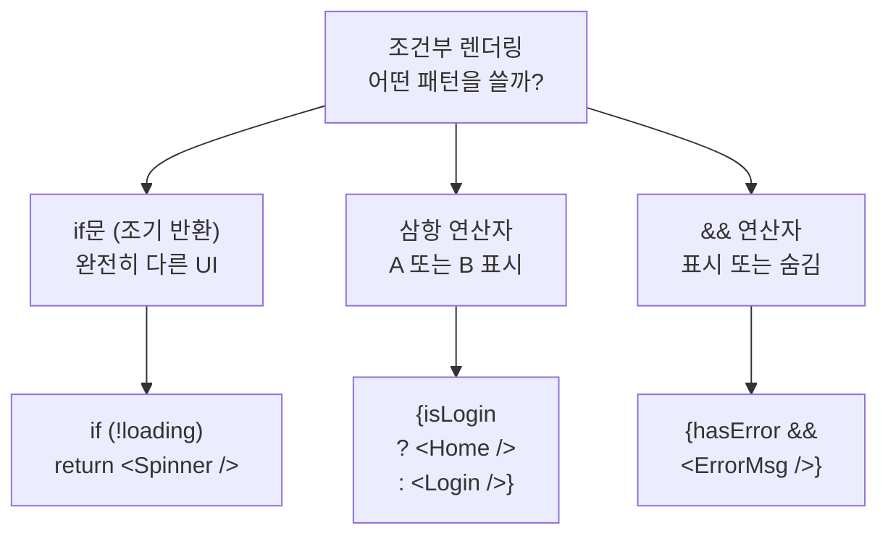
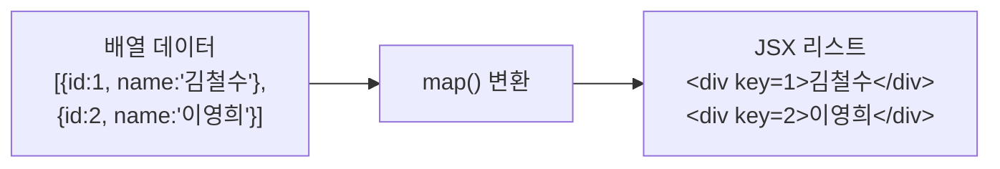
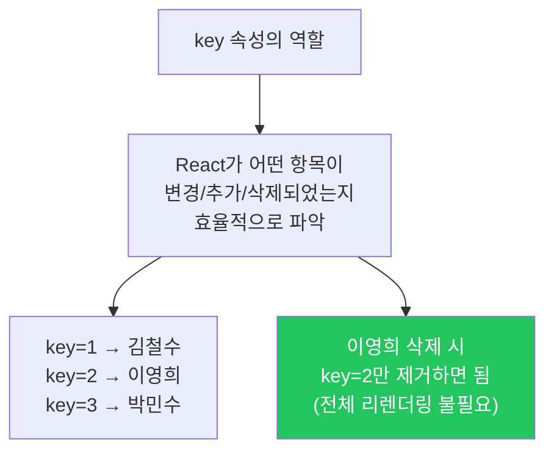

# 챕터 04: 조건부/리스트 렌더링

> **난이도**: ⭐⭐ (2/5)
> **예상 학습 시간**: 2시간
> **선수 지식**: 챕터 01~03 (JSX, Props, State)

---

## 학습 목표

이 챕터를 마치면 다음을 할 수 있습니다:

- 조건에 따라 다른 UI를 렌더링할 수 있습니다
- 삼항 연산자와 && 연산자를 상황에 맞게 사용할 수 있습니다
- `map()`을 사용하여 배열 데이터를 컴포넌트 리스트로 변환할 수 있습니다
- `key` 속성의 역할을 이해하고 올바르게 사용할 수 있습니다

---

## 핵심 개념

### 1. 조건부 렌더링

React에서는 JavaScript의 조건문을 활용하여 **조건에 따라 다른 UI를 표시**할 수 있습니다. 세 가지 주요 패턴이 있습니다.

#### 패턴 1: if문으로 조기 반환

```jsx
function UserStatus({ isLoggedIn }) {
  // 조건에 따라 완전히 다른 UI를 반환
  if (!isLoggedIn) {
    return <button>로그인</button>;
  }

  return <button>로그아웃</button>;
}
```

#### 패턴 2: 삼항 연산자 (조건 ? 참 : 거짓)

두 가지 중 하나를 선택할 때 사용합니다.

```jsx
function Greeting({ isLoggedIn, name }) {
  return (
    <div>
      {isLoggedIn ? (
        <h1>{name}님, 환영합니다!</h1>
      ) : (
        <h1>로그인해주세요.</h1>
      )}
    </div>
  );
}
```

#### 패턴 3: && 연산자 (조건 && 표시할_내용)

조건이 참일 때만 표시하고, 거짓이면 아무것도 표시하지 않을 때 사용합니다.

```jsx
function Notification({ count }) {
  return (
    <div>
      <h1>알림</h1>
      {/* count가 0보다 클 때만 뱃지 표시 */}
      {count > 0 && <span className="badge">{count}개의 새 알림</span>}
    </div>
  );
}
```



#### && 연산자 주의 사항

```jsx
// 주의: 숫자 0은 falsy이지만 화면에 "0"으로 렌더링됩니다!
function MessageCount({ count }) {
  return (
    <div>
      {/* 잘못된 예시: count가 0이면 "0"이 화면에 표시됨 */}
      {count && <p>{count}개의 메시지</p>}

      {/* 올바른 예시: 명시적으로 불리언 비교 */}
      {count > 0 && <p>{count}개의 메시지</p>}
    </div>
  );
}
```

### 2. 리스트 렌더링 (map)

배열 데이터를 UI 리스트로 변환할 때 `map()` 메서드를 사용합니다.

```jsx
function FruitList() {
  const fruits = ["사과", "바나나", "딸기", "포도"];

  return (
    <ul>
      {fruits.map((fruit, index) => (
        <li key={index}>{fruit}</li>
      ))}
    </ul>
  );
}
```

#### 객체 배열 렌더링

```jsx
function UserList() {
  const users = [
    { id: 1, name: "김철수", role: "개발자" },
    { id: 2, name: "이영희", role: "디자이너" },
    { id: 3, name: "박민수", role: "PM" },
  ];

  return (
    <div>
      {users.map((user) => (
        <div key={user.id}>
          <h3>{user.name}</h3>
          <p>{user.role}</p>
        </div>
      ))}
    </div>
  );
}
```



### 3. key 속성

`key`는 React가 리스트의 각 항목을 **고유하게 식별**하기 위한 특별한 속성입니다. key가 없거나 잘못 설정하면 React는 리스트를 비효율적으로 업데이트합니다.

#### key의 규칙

1. **고유해야 합니다** - 형제 요소들 사이에서 유일한 값
2. **안정적이어야 합니다** - 렌더링마다 변하지 않는 값
3. **index를 key로 사용하는 것은 피하세요** - 항목의 순서가 변할 수 있을 때

```jsx
// 좋은 예시: 고유한 id를 key로 사용
{users.map((user) => (
  <UserCard key={user.id} name={user.name} />
))}

// 나쁜 예시: index를 key로 사용 (순서가 변할 수 있는 경우)
{users.map((user, index) => (
  <UserCard key={index} name={user.name} />
))}

// 최악의 예시: key 없음 (경고 발생)
{users.map((user) => (
  <UserCard name={user.name} />
))}
```



#### index를 key로 써도 되는 경우

- 리스트가 **정적**이고 변하지 않을 때
- 항목의 **순서가 절대 변하지 않을 때**
- 항목에 고유 id가 없을 때 (마지막 수단)

### 4. 조건부 + 리스트 렌더링 조합

실제 앱에서는 조건부 렌더링과 리스트 렌더링을 함께 사용하는 경우가 많습니다.

```jsx
function ProductList({ products, showOnlyInStock }) {
  // 조건에 따라 필터링
  const filteredProducts = showOnlyInStock
    ? products.filter((p) => p.inStock)
    : products;

  return (
    <div>
      {filteredProducts.length === 0 ? (
        <p>표시할 상품이 없습니다.</p>
      ) : (
        <ul>
          {filteredProducts.map((product) => (
            <li key={product.id}>
              {product.name} - {product.price.toLocaleString()}원
              {!product.inStock && <span style={{ color: "red" }}> (품절)</span>}
            </li>
          ))}
        </ul>
      )}
    </div>
  );
}
```

---

## 코드로 이해하기

### 예제 1: 상품 목록과 필터링 UI
> 파일: `practice/example-01.jsx` 파일을 참고하세요.

```jsx
function ProductList() {
  const [filter, setFilter] = useState("all");
  const [searchTerm, setSearchTerm] = useState("");

  const filteredProducts = products
    .filter((p) => filter === "all" || p.category === filter)
    .filter((p) => p.name.includes(searchTerm));

  return (
    <div>
      {filteredProducts.map((product) => (
        <ProductCard key={product.id} {...product} />
      ))}
    </div>
  );
}
```

**실행 방법**:
```bash
npx create-react-app ch04-demo
cd ch04-demo
# src/App.js를 example-01.jsx 내용으로 교체
npm start
```

**예상 출력**: 카테고리 필터와 검색 기능이 있는 상품 목록 UI

---

## 주의 사항

- **&& 연산자에서 0 주의**: `{count && <span>...</span>}` -> count가 0이면 `0`이 렌더링됩니다. `{count > 0 && ...}`로 쓰세요.
- **key에 index 사용 주의**: 배열 순서가 변할 수 있는 경우 index를 key로 쓰면 버그가 발생할 수 있습니다.
- **key는 형제 간에만 고유하면 됩니다**: 서로 다른 리스트에서 같은 key를 사용해도 괜찮습니다.
- **map() 안에서 컴포넌트를 정의하지 마세요**: 성능 문제가 발생합니다. 컴포넌트는 밖에서 정의하세요.
- **null, undefined, false, true**는 JSX에서 아무것도 렌더링하지 않습니다. 조건부 렌더링에 활용할 수 있습니다.

---

## 정리

| 개념 | 설명 | 예제 |
|------|------|------|
| 삼항 연산자 | A 또는 B 중 하나를 렌더링 | `{isLogin ? <Home /> : <Login />}` |
| && 연산자 | 조건이 참일 때만 렌더링 | `{hasError && <Error />}` |
| if 조기 반환 | 조건에 따라 다른 컴포넌트 반환 | `if (!data) return <Loading />` |
| map() | 배열을 JSX 리스트로 변환 | `{items.map(i => <li key={i.id}>{i.name}</li>)}` |
| key | 리스트 항목의 고유 식별자 | `key={item.id}` |
| filter() | 조건에 맞는 항목만 추출 | `items.filter(i => i.active)` |

---

## 다음 단계

- `practice/exercise.md`의 연습 문제를 풀어보세요.
- 다음 챕터: **챕터 05 - Hooks 기초**
- 참고 자료:
  - [React 공식 문서 - 조건부 렌더링](https://react.dev/learn/conditional-rendering)
  - [React 공식 문서 - 리스트 렌더링](https://react.dev/learn/rendering-lists)
