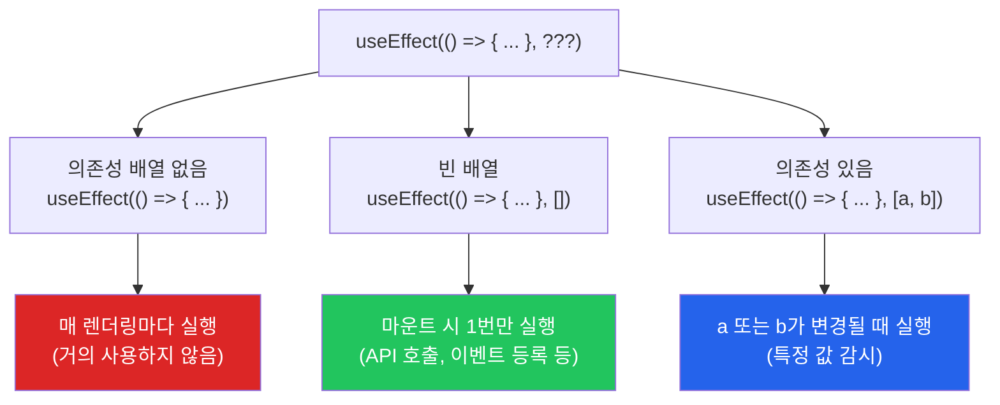
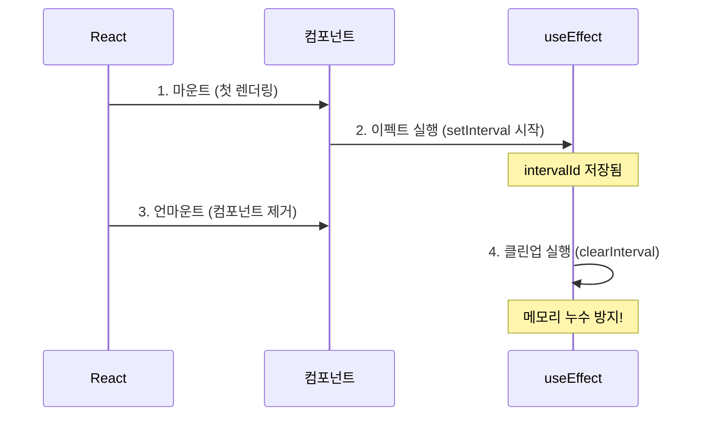
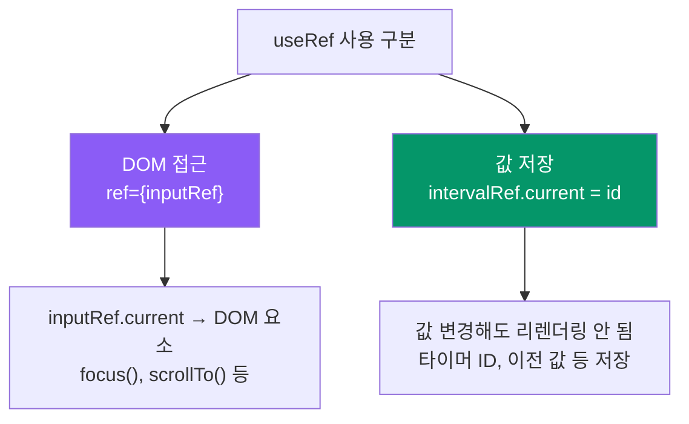
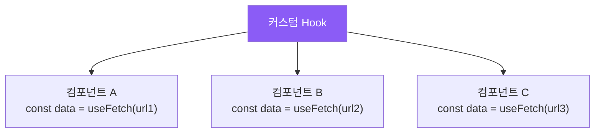

# 챕터 05: Hooks 기초

> **난이도**: ⭐⭐ (2/5)
> **예상 학습 시간**: 2.5시간
> **선수 지식**: 챕터 01~04 (JSX, Props, State, 조건부/리스트 렌더링)

---

## 학습 목표

이 챕터를 마치면 다음을 할 수 있습니다:

- useEffect를 사용하여 사이드 이펙트를 처리할 수 있습니다
- useRef를 사용하여 DOM 요소에 접근하고 값을 유지할 수 있습니다
- 커스텀 Hook을 만들어 로직을 재사용할 수 있습니다
- 의존성 배열의 작동 원리를 이해하고 올바르게 설정할 수 있습니다

---

## 핵심 개념

### 1. useEffect - 사이드 이펙트 처리

**사이드 이펙트(Side Effect)**란 컴포넌트의 렌더링 외에 수행해야 하는 작업을 말합니다.

- 서버에서 데이터 가져오기 (API 호출)
- DOM을 직접 조작하기
- 타이머 설정하기 (setTimeout, setInterval)
- 이벤트 리스너 등록/해제
- 로컬 스토리지 읽기/쓰기

```jsx
import { useEffect } from "react";

useEffect(() => {
  // 사이드 이펙트 코드
  // 컴포넌트가 렌더링된 후 실행됩니다

  return () => {
    // 클린업(정리) 함수 (선택 사항)
    // 컴포넌트가 언마운트되거나, 다음 이펙트 실행 전에 호출됩니다
  };
}, [의존성배열]);
```

#### 의존성 배열에 따른 실행 시점



#### 각 패턴별 예시

```jsx
// 패턴 1: 마운트 시 1번만 실행 (빈 의존성 배열)
useEffect(() => {
  console.log("컴포넌트가 처음 나타났습니다!");

  return () => {
    console.log("컴포넌트가 사라집니다!");
  };
}, []);

// 패턴 2: 특정 값이 변경될 때마다 실행
useEffect(() => {
  console.log(`검색어가 변경되었습니다: ${searchTerm}`);
  // searchTerm이 바뀔 때마다 API 호출 등
}, [searchTerm]);

// 패턴 3: 여러 값 감시
useEffect(() => {
  console.log(`카테고리: ${category}, 페이지: ${page}`);
}, [category, page]);
```

#### 클린업 함수

클린업 함수는 **리소스 정리**를 위해 사용합니다. 이벤트 리스너, 타이머 등을 해제할 때 필수입니다.

```jsx
function Timer() {
  const [seconds, setSeconds] = useState(0);

  useEffect(() => {
    // 타이머 시작
    const intervalId = setInterval(() => {
      setSeconds((prev) => prev + 1);
    }, 1000);

    // 클린업: 컴포넌트가 사라질 때 타이머 해제
    return () => {
      clearInterval(intervalId);
    };
  }, []); // 빈 배열 -> 마운트 시 1번만 설정

  return <p>{seconds}초 경과</p>;
}
```



### 2. useRef - DOM 접근과 값 유지

`useRef`는 두 가지 용도로 사용됩니다:

#### 용도 1: DOM 요소에 직접 접근

```jsx
function TextInput() {
  const inputRef = useRef(null);

  const handleFocus = () => {
    // DOM 요소에 직접 접근
    inputRef.current.focus();
  };

  return (
    <div>
      <input ref={inputRef} placeholder="여기에 입력" />
      <button onClick={handleFocus}>입력창으로 포커스</button>
    </div>
  );
}
```

#### 용도 2: 렌더링에 영향 없는 값 유지

`useRef`로 저장한 값은 변경되어도 **리렌더링을 일으키지 않습니다.** 이전 값 기억, 타이머 ID 저장 등에 유용합니다.

```jsx
function StopWatch() {
  const [time, setTime] = useState(0);
  const [isRunning, setIsRunning] = useState(false);
  const intervalRef = useRef(null); // 타이머 ID 저장 (렌더링과 무관)

  const start = () => {
    setIsRunning(true);
    intervalRef.current = setInterval(() => {
      setTime((prev) => prev + 10);
    }, 10);
  };

  const stop = () => {
    setIsRunning(false);
    clearInterval(intervalRef.current);
  };

  return (
    <div>
      <p>{(time / 1000).toFixed(2)}초</p>
      <button onClick={isRunning ? stop : start}>
        {isRunning ? "정지" : "시작"}
      </button>
    </div>
  );
}
```



#### useState vs useRef 비교

| 특성 | useState | useRef |
|------|----------|--------|
| 값 변경 시 리렌더링 | O (발생) | X (발생 안 함) |
| 값 접근 방법 | `state` 직접 | `ref.current` |
| 주요 용도 | UI에 표시할 데이터 | DOM 접근, 내부 값 저장 |
| 초기값 설정 | `useState(초기값)` | `useRef(초기값)` |

### 3. 커스텀 Hook

**커스텀 Hook**은 React 내장 Hook들을 조합하여 만든 **재사용 가능한 로직 함수**입니다. 이름은 반드시 `use`로 시작해야 합니다.

#### 왜 커스텀 Hook을 만들까?

- **로직 재사용**: 여러 컴포넌트에서 같은 로직을 사용할 때
- **관심사 분리**: 복잡한 컴포넌트에서 로직을 분리할 때
- **테스트 용이성**: 로직을 독립적으로 테스트할 수 있음



#### 커스텀 Hook 예시: useLocalStorage

```jsx
// 로컬 스토리지와 동기화하는 커스텀 Hook
function useLocalStorage(key, initialValue) {
  const [value, setValue] = useState(() => {
    const stored = localStorage.getItem(key);
    return stored ? JSON.parse(stored) : initialValue;
  });

  useEffect(() => {
    localStorage.setItem(key, JSON.stringify(value));
  }, [key, value]);

  return [value, setValue];
}

// 사용하는 컴포넌트
function Settings() {
  const [theme, setTheme] = useLocalStorage("theme", "light");
  const [fontSize, setFontSize] = useLocalStorage("fontSize", 16);
  // ...
}
```

#### 커스텀 Hook 예시: useFetch

```jsx
// 데이터 페칭 커스텀 Hook
function useFetch(url) {
  const [data, setData] = useState(null);
  const [loading, setLoading] = useState(true);
  const [error, setError] = useState(null);

  useEffect(() => {
    let isCancelled = false;

    async function fetchData() {
      setLoading(true);
      setError(null);

      try {
        const response = await fetch(url);
        if (!response.ok) throw new Error("요청 실패");
        const json = await response.json();

        if (!isCancelled) {
          setData(json);
        }
      } catch (err) {
        if (!isCancelled) {
          setError(err.message);
        }
      } finally {
        if (!isCancelled) {
          setLoading(false);
        }
      }
    }

    fetchData();

    return () => {
      isCancelled = true; // 컴포넌트 언마운트 시 요청 무시
    };
  }, [url]);

  return { data, loading, error };
}

// 사용하는 컴포넌트
function UserList() {
  const { data: users, loading, error } = useFetch("/api/users");

  if (loading) return <p>로딩 중...</p>;
  if (error) return <p>오류: {error}</p>;

  return (
    <ul>
      {users.map((user) => (
        <li key={user.id}>{user.name}</li>
      ))}
    </ul>
  );
}
```

---

## 코드로 이해하기

### 예제 1: 데이터 페칭 Hook과 타이머
> 파일: `practice/example-01.jsx` 파일을 참고하세요.

```jsx
function useFetch(url) {
  const [data, setData] = useState(null);
  const [loading, setLoading] = useState(true);
  const [error, setError] = useState(null);

  useEffect(() => {
    fetch(url)
      .then((res) => res.json())
      .then(setData)
      .catch((err) => setError(err.message))
      .finally(() => setLoading(false));
  }, [url]);

  return { data, loading, error };
}
```

**실행 방법**:
```bash
npx create-react-app ch05-demo
cd ch05-demo
# src/App.js를 example-01.jsx 내용으로 교체
npm start
```

**예상 출력**: API에서 가져온 사용자 목록, 스톱워치, 자동 포커스 입력창

### 예제 2: 커스텀 Hook 모음
> 파일: `practice/example-02.jsx` 파일을 참고하세요.

```jsx
function useWindowSize() {
  const [size, setSize] = useState({
    width: window.innerWidth,
    height: window.innerHeight,
  });

  useEffect(() => {
    const handleResize = () => {
      setSize({ width: window.innerWidth, height: window.innerHeight });
    };

    window.addEventListener("resize", handleResize);
    return () => window.removeEventListener("resize", handleResize);
  }, []);

  return size;
}
```

---

## 주의 사항

- **useEffect 안에서 상태를 무한히 업데이트하지 마세요.** 의존성 배열 없이 setState를 호출하면 무한 루프가 발생합니다.
- **useEffect의 의존성 배열을 빠뜨리지 마세요.** ESLint의 `react-hooks/exhaustive-deps` 규칙을 따르세요.
- **useRef.current 변경은 리렌더링을 일으키지 않습니다.** UI에 반영해야 할 값은 반드시 useState를 사용하세요.
- **커스텀 Hook은 반드시 `use`로 시작해야 합니다.** `useCounter` (O), `counter` (X)
- **useEffect의 클린업을 잊지 마세요.** 이벤트 리스너, 타이머, 구독(subscription) 등은 반드시 정리해야 합니다.

---

## 정리

| 개념 | 설명 | 예제 |
|------|------|------|
| useEffect | 사이드 이펙트 처리 | `useEffect(() => { fetch(...) }, [url])` |
| 의존성 배열 | 이펙트 실행 시점 제어 | `[]`: 마운트 시 1번, `[a]`: a 변경 시 |
| 클린업 함수 | 리소스 정리 | `return () => clearInterval(id)` |
| useRef (DOM) | DOM 요소 접근 | `ref={inputRef}` -> `inputRef.current.focus()` |
| useRef (값) | 렌더링 무관 값 저장 | `timerRef.current = setInterval(...)` |
| 커스텀 Hook | 재사용 가능한 로직 | `function useFetch(url) { ... }` |

---

## 다음 단계

- `practice/exercise.md`의 연습 문제를 풀어보세요.
- 다음 챕터: **챕터 06 - 컴포넌트 간 통신과 상태 끌어올리기** (준비 중)
- 참고 자료:
  - [React 공식 문서 - useEffect](https://react.dev/reference/react/useEffect)
  - [React 공식 문서 - useRef](https://react.dev/reference/react/useRef)
  - [React 공식 문서 - 커스텀 Hook](https://react.dev/learn/reusing-logic-with-custom-hooks)
