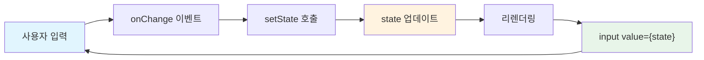
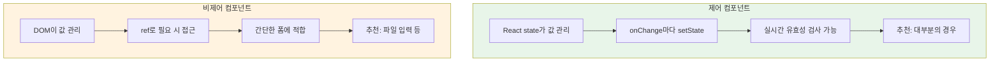

# 챕터 06: 폼과 사용자 입력

> **난이도**: ⭐⭐ (2/5)
> **예상 학습 시간**: 2시간
> **선수 지식**: useState, 이벤트 처리 (챕터 03~05)

---

## 학습 목표

이 챕터를 마치면 다음을 할 수 있습니다:

- 제어 컴포넌트(Controlled Component)와 비제어 컴포넌트(Uncontrolled Component)의 차이를 설명할 수 있다
- `useState`를 활용하여 폼 입력값을 관리할 수 있다
- `useRef`를 사용하여 DOM에 직접 접근하고 비제어 컴포넌트를 구현할 수 있다
- 다양한 폼 요소(텍스트, 체크박스, 셀렉트 등)를 처리할 수 있다
- 폼 유효성 검사를 구현할 수 있다

---

## 핵심 개념

### 1. 제어 컴포넌트 (Controlled Component)

React의 **제어 컴포넌트**는 폼 데이터를 React의 `state`로 관리하는 방식입니다. 입력값의 변경이 항상 `state`를 통해 이루어지므로, "단일 진실 공급원(Single Source of Truth)" 원칙을 따릅니다.

```jsx
// 제어 컴포넌트: state가 입력값을 제어한다
const [name, setName] = useState('');

<input
  type="text"
  value={name}              // state가 value를 결정
  onChange={(e) => setName(e.target.value)}  // 변경 시 state 업데이트
/>
```



**제어 컴포넌트의 장점:**
- 입력값에 대한 즉각적인 검증 가능
- 조건부 제출 버튼 활성화/비활성화
- 입력 형식 강제 (예: 숫자만 입력)
- 여러 입력을 하나의 데이터로 묶어 관리

### 2. 비제어 컴포넌트 (Uncontrolled Component)

**비제어 컴포넌트**는 DOM 자체가 폼 데이터를 관리하며, 필요할 때 `ref`를 통해 값을 가져옵니다. 기존 HTML 폼의 동작 방식과 유사합니다.

```jsx
// 비제어 컴포넌트: DOM이 입력값을 관리한다
const inputRef = useRef(null);

const handleSubmit = () => {
  console.log(inputRef.current.value);  // DOM에서 직접 값을 읽음
};

<input type="text" ref={inputRef} defaultValue="초기값" />
```


### 3. useRef 훅

`useRef`는 두 가지 주요 용도로 사용됩니다:

1. **DOM 요소 참조**: 특정 DOM 요소에 직접 접근
2. **값 보존**: 리렌더링 사이에 값을 유지하되, 변경 시 리렌더링을 일으키지 않음

```jsx
import { useRef } from 'react';

function FocusInput() {
  const inputRef = useRef(null);

  const handleClick = () => {
    inputRef.current.focus();  // DOM 메서드 직접 호출
  };

  return (
    <>
      <input ref={inputRef} />
      <button onClick={handleClick}>입력란에 포커스</button>
    </>
  );
}
```

### 4. 제어 vs 비제어 컴포넌트 비교



| 기능 | 제어 컴포넌트 | 비제어 컴포넌트 |
|------|:---:|:---:|
| 실시간 값 접근 | O | X |
| 즉시 유효성 검사 | O | X |
| 조건부 UI 변경 | O | X |
| 코드 간결성 | X | O |
| 파일 입력 처리 | X | O |

### 5. 다양한 폼 요소 처리

```jsx
function FormElements() {
  const [formData, setFormData] = useState({
    username: '',
    age: 0,
    gender: 'male',
    agree: false,
    bio: '',
  });

  // 모든 입력 요소를 하나의 핸들러로 처리
  const handleChange = (e) => {
    const { name, value, type, checked } = e.target;
    setFormData((prev) => ({
      ...prev,
      [name]: type === 'checkbox' ? checked : value,
    }));
  };

  return (
    <form>
      {/* 텍스트 입력 */}
      <input name="username" value={formData.username} onChange={handleChange} />

      {/* 숫자 입력 */}
      <input name="age" type="number" value={formData.age} onChange={handleChange} />

      {/* 셀렉트 */}
      <select name="gender" value={formData.gender} onChange={handleChange}>
        <option value="male">남성</option>
        <option value="female">여성</option>
      </select>

      {/* 체크박스 */}
      <input name="agree" type="checkbox" checked={formData.agree} onChange={handleChange} />

      {/* 텍스트영역 */}
      <textarea name="bio" value={formData.bio} onChange={handleChange} />
    </form>
  );
}
```

### 6. 폼 유효성 검사

```jsx
function ValidatedForm() {
  const [email, setEmail] = useState('');
  const [errors, setErrors] = useState({});

  const validate = (value) => {
    const newErrors = {};
    if (!value) {
      newErrors.email = '이메일을 입력해주세요';
    } else if (!/\S+@\S+\.\S+/.test(value)) {
      newErrors.email = '올바른 이메일 형식이 아닙니다';
    }
    setErrors(newErrors);
    return Object.keys(newErrors).length === 0;
  };

  const handleSubmit = (e) => {
    e.preventDefault();       // 기본 폼 제출 방지
    if (validate(email)) {
      console.log('제출 성공:', email);
    }
  };

  return (
    <form onSubmit={handleSubmit}>
      <input
        value={email}
        onChange={(e) => setEmail(e.target.value)}
      />
      {errors.email && <span style={{ color: 'red' }}>{errors.email}</span>}
      <button type="submit">제출</button>
    </form>
  );
}
```

---

## 코드로 이해하기

### 예제 1: 제어 컴포넌트 기반 회원가입 폼
> 📁 `practice/example-01.jsx` 파일을 참고하세요.

```jsx
// 핵심: 모든 폼 필드를 하나의 state 객체로 관리
const [formData, setFormData] = useState({
  username: '',
  email: '',
  password: '',
  confirmPassword: '',
});

// 단일 핸들러로 모든 필드 처리
const handleChange = (e) => {
  const { name, value } = e.target;
  setFormData((prev) => ({ ...prev, [name]: value }));
};
```

**실행 방법**:
```bash
# 프로젝트 루트에서
npx create-react-app form-demo
cd form-demo
# src/App.js에 example-01.jsx 내용을 복사
npm start
```

**예상 출력**: 유효성 검사가 포함된 회원가입 폼이 브라우저에 표시됩니다.

### 예제 2: useRef를 활용한 비제어 컴포넌트와 포커스 관리
> 📁 `practice/example-02.jsx` 파일을 참고하세요.

```jsx
// 핵심: ref로 DOM에 직접 접근
const usernameRef = useRef(null);
const emailRef = useRef(null);

// 엔터키를 누르면 다음 필드로 포커스 이동
const handleKeyDown = (e, nextRef) => {
  if (e.key === 'Enter') {
    e.preventDefault();
    nextRef.current.focus();
  }
};
```

**실행 방법**:
```bash
# example-01.jsx와 동일한 방법
# src/App.js에 example-02.jsx 내용을 복사
npm start
```

**예상 출력**: 엔터키로 다음 입력란으로 이동하며, 제출 시 ref로 값을 읽어오는 폼이 표시됩니다.

---

## 주의 사항

- ⚠️ **e.preventDefault() 누락**: `<form onSubmit={handleSubmit}>`에서 `e.preventDefault()`를 호출하지 않으면 페이지가 새로고침됩니다.
- ⚠️ **value만 지정하고 onChange 누락**: `<input value={state} />`만 적고 `onChange`를 안 주면 입력이 안 되는 읽기 전용 필드가 됩니다.
- ⚠️ **defaultValue와 value 혼용 금지**: 제어 컴포넌트에는 `value`, 비제어 컴포넌트에는 `defaultValue`를 사용해야 합니다.
- 💡 **팁**: 여러 입력 필드가 있을 때는 `name` 속성과 `[name]: value` 패턴을 활용하면 핸들러 하나로 관리할 수 있습니다.
- 💡 **팁**: 파일 입력(`<input type="file">`)은 읽기 전용이므로 반드시 비제어 컴포넌트로 처리해야 합니다.

---

## 정리

| 개념 | 설명 | 예제 |
|------|------|------|
| 제어 컴포넌트 | state로 입력값 관리, value + onChange 패턴 | `<input value={state} onChange={handler} />` |
| 비제어 컴포넌트 | DOM이 값 관리, ref로 접근 | `<input ref={inputRef} defaultValue="..." />` |
| useRef | DOM 참조 및 리렌더링 없는 값 보존 | `const ref = useRef(null)` |
| 단일 핸들러 패턴 | name 속성으로 여러 필드를 하나의 핸들러로 관리 | `[e.target.name]: e.target.value` |
| 유효성 검사 | 실시간 또는 제출 시 입력값 검증 | `errors` state + 조건부 렌더링 |
| e.preventDefault() | 폼의 기본 제출 동작(페이지 새로고침) 방지 | `onSubmit` 핸들러 내부에서 호출 |

---

## 다음 단계

- ✅ `practice/exercise.md`의 연습 문제를 풀어보세요.
- 📖 다음 챕터: **챕터 07 - 사이드 이펙트와 생명주기** (useEffect, API 데이터 페칭)
- 🔗 참고 자료:
  - [React 공식 문서 - 폼](https://react.dev/reference/react-dom/components/input)
  - [React 공식 문서 - useRef](https://react.dev/reference/react/useRef)
