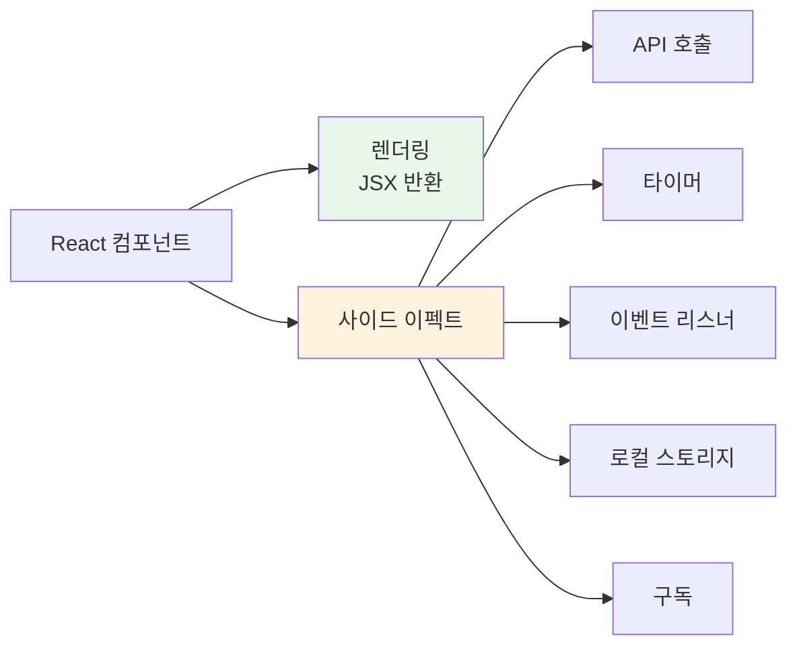
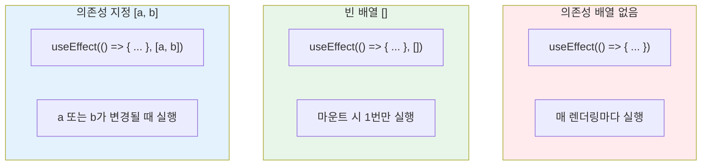
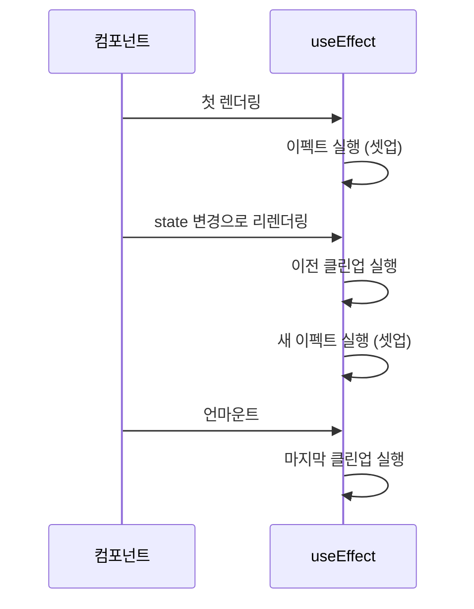
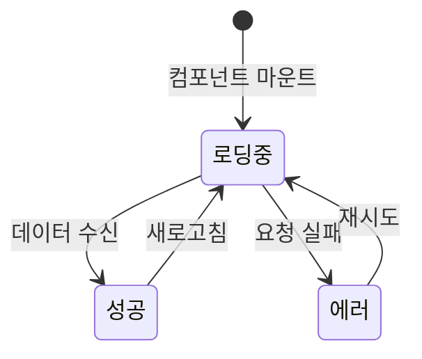

# 챕터 07: 사이드 이펙트와 생명주기

> **난이도**: ⭐⭐ (2/5)
> **예상 학습 시간**: 2.5시간
> **선수 지식**: useState, 이벤트 처리 (챕터 03~06)

---

## 학습 목표

이 챕터를 마치면 다음을 할 수 있습니다:

- 사이드 이펙트(Side Effect)가 무엇인지 설명할 수 있다
- `useEffect`의 의존성 배열을 올바르게 설정할 수 있다
- 클린업(cleanup) 함수의 필요성과 사용법을 이해한다
- API 데이터를 비동기적으로 가져오고 화면에 표시할 수 있다
- 로딩 상태와 에러 처리를 구현할 수 있다

---

## 핵심 개념

### 1. 사이드 이펙트(Side Effect)란?

React 컴포넌트의 주된 역할은 **JSX를 렌더링**하는 것입니다. 그 외에 컴포넌트가 수행하는 모든 작업을 **사이드 이펙트**라고 합니다.

대표적인 사이드 이펙트:
- 외부 API 호출 (데이터 페칭)
- DOM 직접 조작
- 타이머 설정 (`setTimeout`, `setInterval`)
- 이벤트 리스너 등록/해제
- 로컬 스토리지 접근
- 구독(subscription) 설정/해제



### 2. useEffect 기본 구조

`useEffect`는 컴포넌트가 렌더링된 **이후에** 실행되는 함수를 등록합니다.

```jsx
import { useEffect } from 'react';

useEffect(() => {
  // 이 코드는 렌더링 이후에 실행됩니다
  console.log('이펙트 실행!');

  // (선택) 클린업 함수를 반환할 수 있습니다
  return () => {
    console.log('이펙트 정리(클린업)!');
  };
}, [/* 의존성 배열 */]);
```

### 3. 의존성 배열(Dependency Array)

의존성 배열은 이펙트가 **언제 다시 실행될지**를 결정합니다. 이것이 `useEffect`의 가장 중요한 부분입니다.



```jsx
// 1) 의존성 배열 없음 -> 매 렌더링마다 실행 (주의: 거의 사용하지 않음)
useEffect(() => {
  console.log('매번 실행됨');
});

// 2) 빈 배열 [] -> 마운트 시 딱 1번 실행
useEffect(() => {
  console.log('컴포넌트가 처음 나타날 때 1번 실행');
}, []);

// 3) 의존성 지정 [count] -> count가 변경될 때마다 실행
useEffect(() => {
  console.log(`count가 ${count}로 변경됨`);
}, [count]);
```

### 4. 클린업(Cleanup) 함수

이펙트가 설정한 것을 **해제(정리)** 해야 할 때 클린업 함수를 사용합니다. 클린업은 다음 이펙트가 실행되기 전이나 컴포넌트가 화면에서 사라질 때(언마운트) 실행됩니다.



```jsx
// 타이머 예시: 클린업으로 타이머를 해제해야 메모리 누수 방지
useEffect(() => {
  const timerId = setInterval(() => {
    console.log('1초마다 실행');
  }, 1000);

  // 클린업: 타이머 해제
  return () => {
    clearInterval(timerId);
  };
}, []);

// 이벤트 리스너 예시
useEffect(() => {
  const handleResize = () => {
    console.log('윈도우 크기:', window.innerWidth);
  };

  window.addEventListener('resize', handleResize);

  // 클린업: 이벤트 리스너 해제
  return () => {
    window.removeEventListener('resize', handleResize);
  };
}, []);
```

### 5. 비동기 처리와 데이터 페칭

`useEffect`의 콜백 함수 자체를 `async`로 만들 수는 없습니다. 대신 내부에 async 함수를 정의하고 호출하는 패턴을 사용합니다.

```jsx
// 잘못된 방법 (에러 발생)
useEffect(async () => {  // ❌ useEffect는 async 함수를 직접 받을 수 없음
  const data = await fetch('/api/data');
}, []);

// 올바른 방법
useEffect(() => {
  const fetchData = async () => {
    try {
      const response = await fetch('/api/data');
      const data = await response.json();
      setData(data);
    } catch (error) {
      setError(error.message);
    }
  };

  fetchData();  // async 함수를 정의 후 호출
}, []);
```

### 6. 데이터 페칭 패턴: 로딩/에러/데이터

API를 호출할 때는 세 가지 상태를 관리하는 것이 일반적입니다:



```jsx
function DataFetcher() {
  const [data, setData] = useState(null);     // 데이터
  const [loading, setLoading] = useState(true); // 로딩 상태
  const [error, setError] = useState(null);    // 에러 상태

  useEffect(() => {
    const fetchData = async () => {
      try {
        setLoading(true);
        setError(null);
        const response = await fetch('https://api.example.com/data');
        if (!response.ok) throw new Error('데이터를 불러오지 못했습니다');
        const result = await response.json();
        setData(result);
      } catch (err) {
        setError(err.message);
      } finally {
        setLoading(false);
      }
    };

    fetchData();
  }, []);

  if (loading) return <p>로딩 중...</p>;
  if (error) return <p>에러: {error}</p>;
  return <div>{/* 데이터 표시 */}</div>;
}
```

---

## 코드로 이해하기

### 예제 1: API 데이터 페칭과 실시간 검색
> 📁 `practice/example-01.jsx` 파일을 참고하세요.

```jsx
// 핵심: 검색어 변경 시 API 호출 (디바운스 적용)
useEffect(() => {
  const timer = setTimeout(() => {
    fetchUsers(debouncedQuery);
  }, 500);

  return () => clearTimeout(timer);
}, [debouncedQuery]);
```

**실행 방법**:
```bash
npx create-react-app effect-demo
cd effect-demo
# src/App.js에 example-01.jsx 내용을 복사
npm start
```

**예상 출력**: 사용자 목록을 불러오고, 검색 입력에 따라 실시간으로 필터링됩니다.

### 예제 2: 타이머, 윈도우 이벤트, 로컬 스토리지
> 📁 `practice/example-02.jsx` 파일을 참고하세요.

```jsx
// 핵심: 여러 종류의 사이드 이펙트와 클린업
useEffect(() => {
  const id = setInterval(() => setSeconds(s => s + 1), 1000);
  return () => clearInterval(id);  // 클린업 필수!
}, []);
```

**실행 방법**:
```bash
# example-01.jsx와 동일
# src/App.js에 example-02.jsx 내용을 복사
npm start
```

**예상 출력**: 스톱워치, 윈도우 크기 추적기, 로컬 스토리지 메모장이 표시됩니다.

---

## 주의 사항

- ⚠️ **무한 루프 주의**: 이펙트 안에서 state를 업데이트하는데 의존성 배열에 해당 state가 포함되면 무한 루프가 발생할 수 있습니다.
  ```jsx
  // ❌ 무한 루프!
  const [count, setCount] = useState(0);
  useEffect(() => {
    setCount(count + 1);  // count가 바뀌면 이펙트 재실행 -> 다시 count 변경 -> ...
  }, [count]);
  ```
- ⚠️ **객체/배열 의존성**: 매 렌더링마다 새로 생성되는 객체/배열은 의존성 배열에 넣으면 매번 이펙트가 실행됩니다. `useMemo`나 원시값으로 변환하세요.
- ⚠️ **async 함수**: `useEffect` 콜백을 직접 `async`로 만들지 마세요. 내부에서 async 함수를 따로 정의하세요.
- 💡 **팁**: 이펙트를 작성할 때 "이 이펙트가 정리해야 할 것이 있는가?"를 항상 자문하세요.
- 💡 **팁**: React 18 Strict Mode에서는 개발 중 이펙트가 두 번 실행될 수 있습니다. 이는 정상 동작입니다.

---

## 정리

| 개념 | 설명 | 예제 |
|------|------|------|
| useEffect | 렌더링 이후 사이드 이펙트 실행 | `useEffect(() => { ... }, [deps])` |
| 의존성 배열 | 이펙트 재실행 조건 지정 | `[]` = 1회, `[a]` = a 변경 시 |
| 클린업 함수 | 이펙트 정리(구독해제, 타이머 해제 등) | `return () => { clearInterval(id) }` |
| 데이터 페칭 | API 호출 + 로딩/에러/데이터 상태 관리 | `fetch().then().catch()` |
| 디바운스 | 연속된 이벤트에서 마지막 것만 처리 | `setTimeout` + 클린업으로 구현 |

---

## 다음 단계

- ✅ `practice/exercise.md`의 연습 문제를 풀어보세요.
- 📖 다음 챕터: **챕터 08 - Context와 전역 상태** (createContext, useContext, useReducer)
- 🔗 참고 자료:
  - [React 공식 문서 - useEffect](https://react.dev/reference/react/useEffect)
  - [React 공식 문서 - Synchronizing with Effects](https://react.dev/learn/synchronizing-with-effects)
