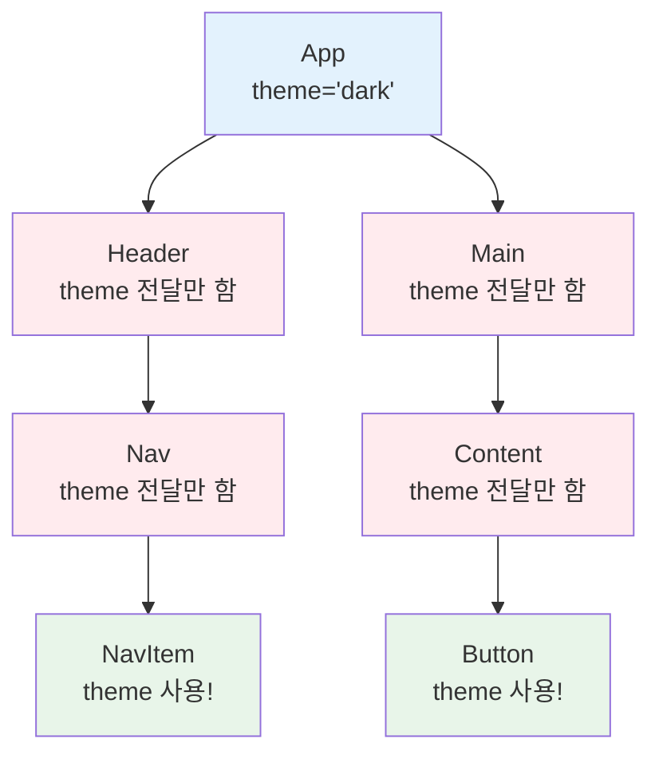
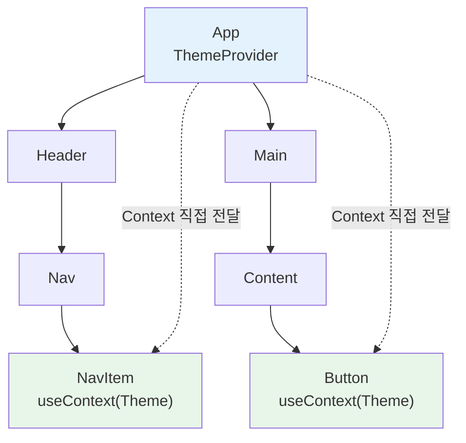
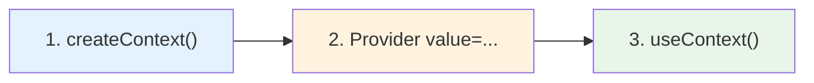
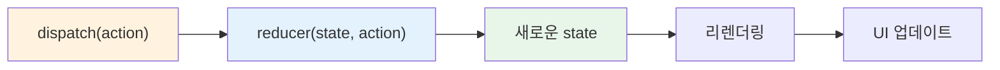
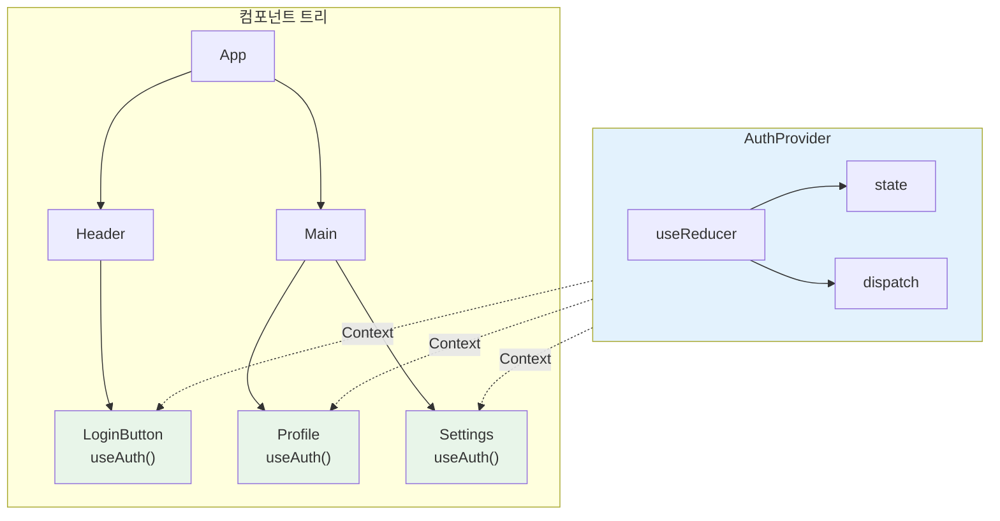

# 챕터 08: Context와 전역 상태

> **난이도**: ⭐⭐⭐ (3/5)
> **예상 학습 시간**: 3시간
> **선수 지식**: useState, useEffect, 컴포넌트 구조 (챕터 03~07)

---

## 학습 목표

이 챕터를 마치면 다음을 할 수 있습니다:

- Props Drilling 문제를 이해하고 Context로 해결할 수 있다
- `createContext`, `useContext`, `Provider`를 사용하여 전역 상태를 구현할 수 있다
- `useReducer`로 복잡한 상태 로직을 관리할 수 있다
- Context + useReducer 패턴으로 전역 상태 관리 시스템을 구축할 수 있다

---

## 핵심 개념

### 1. Props Drilling 문제

**Props Drilling**은 중간 컴포넌트들이 실제로는 사용하지 않는 props를 단순히 하위 컴포넌트에 전달하기 위해 받아야 하는 문제입니다.



위 그림에서 빨간색 컴포넌트들은 `theme`을 사용하지 않으면서도 전달만 하고 있습니다. 컴포넌트 트리가 깊어질수록 이 문제는 심각해집니다.

### 2. Context API로 해결

Context를 사용하면 중간 컴포넌트를 거치지 않고 **데이터를 직접 전달**할 수 있습니다.



### 3. Context 사용법 (3단계)

```jsx
import { createContext, useContext } from 'react';

// 1단계: Context 생성
const ThemeContext = createContext('light');  // 기본값 설정

// 2단계: Provider로 값 공급
function App() {
  const [theme, setTheme] = useState('dark');
  return (
    <ThemeContext.Provider value={theme}>
      <Header />
      <Main />
    </ThemeContext.Provider>
  );
}

// 3단계: useContext로 값 소비
function Button() {
  const theme = useContext(ThemeContext);  // 'dark'
  return <button className={theme}>클릭</button>;
}
```



### 4. useReducer 훅

`useReducer`는 `useState`의 대안으로, **복잡한 상태 로직**을 관리할 때 유용합니다. Redux의 reducer 패턴과 동일합니다.

```jsx
import { useReducer } from 'react';

// 리듀서 함수: (현재 state, action) => 새로운 state
function counterReducer(state, action) {
  switch (action.type) {
    case 'INCREMENT':
      return { count: state.count + 1 };
    case 'DECREMENT':
      return { count: state.count - 1 };
    case 'RESET':
      return { count: 0 };
    default:
      throw new Error(`알 수 없는 액션: ${action.type}`);
  }
}

function Counter() {
  // useReducer(리듀서 함수, 초기 state)
  const [state, dispatch] = useReducer(counterReducer, { count: 0 });

  return (
    <div>
      <p>카운트: {state.count}</p>
      <button onClick={() => dispatch({ type: 'INCREMENT' })}>+1</button>
      <button onClick={() => dispatch({ type: 'DECREMENT' })}>-1</button>
      <button onClick={() => dispatch({ type: 'RESET' })}>초기화</button>
    </div>
  );
}
```



### 5. useState vs useReducer

| 기준 | useState | useReducer |
|------|----------|------------|
| 상태 구조 | 단순 (숫자, 문자열, boolean) | 복잡 (객체, 배열, 중첩) |
| 업데이트 로직 | 간단한 값 교체 | 여러 액션 타입, 복잡한 로직 |
| 관련 state | 독립적인 state들 | 서로 연관된 state들 |
| 디버깅 | 단순 | action.type으로 추적 용이 |

### 6. Context + useReducer 패턴

전역 상태 관리의 핵심 패턴입니다. Context로 state와 dispatch를 전달하고, 어느 컴포넌트에서든 useContext로 접근합니다.

```jsx
// 1. Context 생성
const AuthContext = createContext();

// 2. 리듀서 정의
function authReducer(state, action) {
  switch (action.type) {
    case 'LOGIN':
      return { ...state, user: action.payload, isLoggedIn: true };
    case 'LOGOUT':
      return { ...state, user: null, isLoggedIn: false };
    default:
      return state;
  }
}

// 3. Provider 컴포넌트 (재사용 가능)
function AuthProvider({ children }) {
  const [state, dispatch] = useReducer(authReducer, {
    user: null,
    isLoggedIn: false,
  });

  return (
    <AuthContext.Provider value={{ state, dispatch }}>
      {children}
    </AuthContext.Provider>
  );
}

// 4. 커스텀 훅으로 사용 편의성 향상
function useAuth() {
  const context = useContext(AuthContext);
  if (!context) {
    throw new Error('useAuth는 AuthProvider 안에서만 사용할 수 있습니다');
  }
  return context;
}

// 5. 컴포넌트에서 사용
function ProfileButton() {
  const { state, dispatch } = useAuth();

  if (state.isLoggedIn) {
    return <button onClick={() => dispatch({ type: 'LOGOUT' })}>로그아웃</button>;
  }
  return <button>로그인</button>;
}
```



---

## 코드로 이해하기

### 예제 1: 테마 전환 + 인증 상태 관리
> 📁 `practice/example-01.jsx` 파일을 참고하세요.

```jsx
// 핵심: 두 개의 Context를 결합하여 사용
<ThemeProvider>
  <AuthProvider>
    <App />
  </AuthProvider>
</ThemeProvider>
```

**실행 방법**:
```bash
npx create-react-app context-demo
cd context-demo
# src/App.js에 example-01.jsx 내용을 복사
npm start
```

**예상 출력**: 테마 전환 토글과 로그인/로그아웃 기능이 있는 페이지가 표시됩니다.

### 예제 2: useReducer로 장바구니 구현
> 📁 `practice/example-02.jsx` 파일을 참고하세요.

```jsx
// 핵심: 복잡한 장바구니 로직을 reducer로 관리
function cartReducer(state, action) {
  switch (action.type) {
    case 'ADD_ITEM': ...
    case 'REMOVE_ITEM': ...
    case 'UPDATE_QUANTITY': ...
    case 'CLEAR_CART': ...
  }
}
```

**실행 방법**:
```bash
# example-01.jsx와 동일
# src/App.js에 example-02.jsx 내용을 복사
npm start
```

**예상 출력**: 상품 목록에서 장바구니에 추가/삭제/수량 변경이 가능한 쇼핑 페이지가 표시됩니다.

---

## 주의 사항

- ⚠️ **Context를 남용하지 마세요**: 모든 state를 Context에 넣을 필요는 없습니다. 가까운 컴포넌트 간에는 props가 더 적합합니다.
- ⚠️ **Provider 없이 useContext 사용**: Provider로 감싸지 않은 곳에서 useContext를 호출하면 createContext의 기본값이 사용됩니다.
- ⚠️ **불필요한 리렌더링**: Context의 value가 변경되면 해당 Context를 사용하는 **모든** 컴포넌트가 리렌더링됩니다. value에 객체를 넣을 때는 `useMemo`를 고려하세요.
- 💡 **팁**: Context를 목적별로 분리하세요 (ThemeContext, AuthContext 등). 하나의 거대한 Context보다 여러 작은 Context가 성능에 유리합니다.
- 💡 **팁**: 커스텀 훅(`useAuth`, `useTheme` 등)을 만들면 Context 사용이 훨씬 편리해집니다.

---

## 정리

| 개념 | 설명 | 예제 |
|------|------|------|
| Props Drilling | 중간 컴포넌트가 불필요하게 props를 전달하는 문제 | A → B → C → D (B, C는 사용 안 함) |
| createContext | Context 객체 생성 | `const Ctx = createContext(defaultValue)` |
| Provider | 하위 트리에 값 공급 | `<Ctx.Provider value={...}>` |
| useContext | Context 값 소비 | `const value = useContext(Ctx)` |
| useReducer | 복잡한 상태 로직 관리 | `const [state, dispatch] = useReducer(reducer, init)` |
| dispatch | 액션을 리듀서에 전달 | `dispatch({ type: 'ACTION', payload: data })` |

---

## 다음 단계

- ✅ `practice/exercise.md`의 연습 문제를 풀어보세요.
- 📖 다음 챕터: **챕터 09 - React Router를 이용한 라우팅** (BrowserRouter, Route, Link)
- 🔗 참고 자료:
  - [React 공식 문서 - useContext](https://react.dev/reference/react/useContext)
  - [React 공식 문서 - useReducer](https://react.dev/reference/react/useReducer)
  - [React 공식 문서 - Passing Data Deeply with Context](https://react.dev/learn/passing-data-deeply-with-context)
