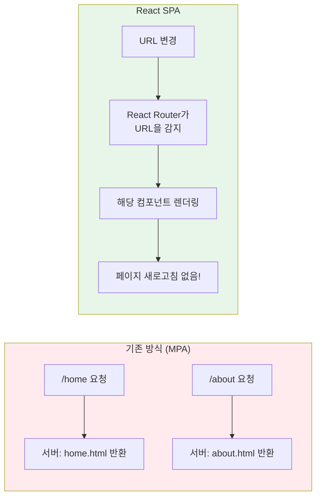
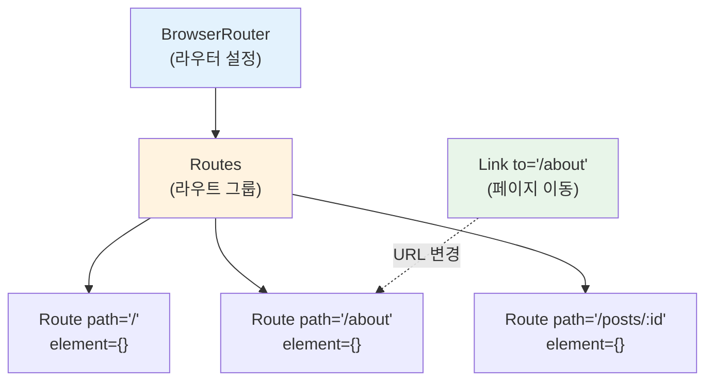
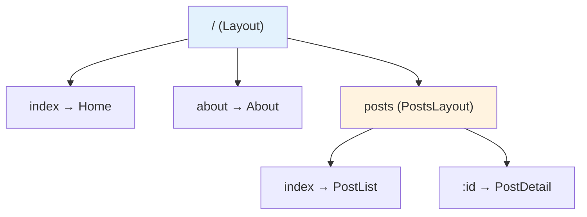

# 챕터 09: React Router를 이용한 라우팅

> **난이도**: ⭐⭐⭐ (3/5)
> **예상 학습 시간**: 3시간
> **선수 지식**: 컴포넌트, props, useState, useEffect (챕터 03~07)

---

## 학습 목표

이 챕터를 마치면 다음을 할 수 있습니다:

- SPA(Single Page Application)에서 라우팅의 필요성을 설명할 수 있다
- React Router의 핵심 컴포넌트(BrowserRouter, Routes, Route, Link)를 사용할 수 있다
- URL 파라미터(`useParams`)와 프로그래밍 방식 네비게이션(`useNavigate`)을 활용할 수 있다
- 중첩 라우팅(Nested Routes)과 레이아웃 패턴을 구현할 수 있다
- 404 페이지와 리다이렉트를 처리할 수 있다

---

## 핵심 개념

### 1. SPA와 라우팅

기존 웹사이트(MPA)는 페이지 이동 시마다 서버에서 새로운 HTML을 받아옵니다. SPA에서는 **하나의 HTML** 위에서 JavaScript가 URL에 따라 화면을 전환합니다.



### 2. React Router 설치

```bash
npm install react-router-dom
```

### 3. 핵심 컴포넌트



```jsx
import { BrowserRouter, Routes, Route, Link } from 'react-router-dom';

function App() {
  return (
    <BrowserRouter>
      {/* 네비게이션 - Link는 <a> 태그 대신 사용 (새로고침 방지) */}
      <nav>
        <Link to="/">홈</Link>
        <Link to="/about">소개</Link>
        <Link to="/posts">게시글</Link>
      </nav>

      {/* 라우트 정의 */}
      <Routes>
        <Route path="/" element={<Home />} />
        <Route path="/about" element={<About />} />
        <Route path="/posts" element={<Posts />} />
        <Route path="/posts/:id" element={<PostDetail />} />
        <Route path="*" element={<NotFound />} />  {/* 404 */}
      </Routes>
    </BrowserRouter>
  );
}
```

### 4. Link vs a 태그

| 기능 | `<Link>` | `<a>` |
|------|----------|-------|
| 페이지 새로고침 | X (SPA 유지) | O (전체 새로고침) |
| state 유지 | O | X (초기화됨) |
| 성능 | 빠름 | 느림 |
| 사용 시점 | 앱 내부 이동 | 외부 링크 |

```jsx
// 앱 내부 이동: Link 사용
<Link to="/about">소개 페이지</Link>

// 외부 링크: a 태그 사용
<a href="https://react.dev" target="_blank" rel="noopener noreferrer">
  React 공식 문서
</a>
```

### 5. useParams - URL 파라미터

URL의 동적 부분을 읽어올 때 사용합니다.

```jsx
// 라우트 정의: :id 는 동적 파라미터
<Route path="/posts/:id" element={<PostDetail />} />

// 컴포넌트에서 파라미터 읽기
import { useParams } from 'react-router-dom';

function PostDetail() {
  const { id } = useParams();  // URL이 /posts/42 이면 id = "42"

  return <h1>게시글 #{id}</h1>;
}
```

### 6. useNavigate - 프로그래밍 방식 네비게이션

버튼 클릭이나 폼 제출 후 코드로 페이지를 이동할 때 사용합니다.

```jsx
import { useNavigate } from 'react-router-dom';

function LoginForm() {
  const navigate = useNavigate();

  const handleSubmit = (e) => {
    e.preventDefault();
    // 로그인 처리...
    navigate('/dashboard');         // 대시보드로 이동
    // navigate(-1);                // 뒤로 가기
    // navigate('/home', { replace: true });  // 히스토리 교체 (뒤로가기 불가)
  };

  return <form onSubmit={handleSubmit}>...</form>;
}
```

### 7. 중첩 라우팅 (Nested Routes)

레이아웃을 공유하는 페이지들을 중첩 라우트로 구성합니다.



```jsx
import { Outlet } from 'react-router-dom';

// 공통 레이아웃 컴포넌트
function Layout() {
  return (
    <div>
      <header>헤더 (모든 페이지에 표시)</header>
      <main>
        <Outlet />  {/* 자식 라우트의 컴포넌트가 여기에 렌더링됨 */}
      </main>
      <footer>푸터 (모든 페이지에 표시)</footer>
    </div>
  );
}

function App() {
  return (
    <BrowserRouter>
      <Routes>
        <Route path="/" element={<Layout />}>
          {/* index: 부모 경로(/)와 정확히 일치할 때 */}
          <Route index element={<Home />} />
          <Route path="about" element={<About />} />

          {/* 중첩 라우트 */}
          <Route path="posts">
            <Route index element={<PostList />} />
            <Route path=":id" element={<PostDetail />} />
          </Route>

          {/* 404 */}
          <Route path="*" element={<NotFound />} />
        </Route>
      </Routes>
    </BrowserRouter>
  );
}
```

### 8. NavLink - 활성 링크 스타일링

현재 URL과 일치하는 링크에 자동으로 스타일을 적용합니다.

```jsx
import { NavLink } from 'react-router-dom';

function Navigation() {
  return (
    <nav>
      <NavLink
        to="/"
        style={({ isActive }) => ({
          color: isActive ? '#1976d2' : '#333',
          fontWeight: isActive ? 'bold' : 'normal',
        })}
      >
        홈
      </NavLink>
    </nav>
  );
}
```

### 9. useSearchParams - 쿼리 파라미터

URL의 `?key=value` 부분을 읽고 쓸 때 사용합니다.

```jsx
import { useSearchParams } from 'react-router-dom';

function SearchPage() {
  const [searchParams, setSearchParams] = useSearchParams();
  const query = searchParams.get('q') || '';  // ?q=react → 'react'

  return (
    <input
      value={query}
      onChange={(e) => setSearchParams({ q: e.target.value })}
      placeholder="검색..."
    />
  );
}
```

---

## 코드로 이해하기

### 예제 1: 다중 페이지 블로그 레이아웃
> 📁 `practice/example-01.jsx` 파일을 참고하세요.

```jsx
// 핵심: 중첩 라우팅으로 블로그 레이아웃 구현
<Route path="/" element={<Layout />}>
  <Route index element={<Home />} />
  <Route path="posts" element={<PostList />} />
  <Route path="posts/:id" element={<PostDetail />} />
  <Route path="about" element={<About />} />
  <Route path="*" element={<NotFound />} />
</Route>
```

**실행 방법**:
```bash
npx create-react-app blog-demo
cd blog-demo
npm install react-router-dom
# src/App.js에 example-01.jsx 내용을 복사
npm start
```

**예상 출력**: 네비게이션 바, 게시글 목록, 게시글 상세 페이지가 있는 블로그가 표시됩니다.

---

## 주의 사항

- ⚠️ **`<a>` 대신 `<Link>` 사용**: 앱 내부 이동에 `<a>` 태그를 사용하면 SPA의 장점(state 유지, 빠른 전환)이 사라집니다.
- ⚠️ **BrowserRouter 중복**: `BrowserRouter`는 앱에서 **한 번만** 사용해야 합니다. 보통 최상위 컴포넌트에서 감쌉니다.
- ⚠️ **useParams 반환값은 문자열**: URL 파라미터는 항상 문자열입니다. 숫자로 사용하려면 `Number(id)` 변환이 필요합니다.
- 💡 **팁**: 페이지 컴포넌트와 UI 컴포넌트를 분리하세요. 페이지 컴포넌트는 라우팅 로직을, UI 컴포넌트는 표시 로직을 담당합니다.
- 💡 **팁**: `useNavigate(-1)`로 뒤로 가기, `useNavigate(-2)`로 두 단계 뒤로 갈 수 있습니다.

---

## 정리

| 개념 | 설명 | 예제 |
|------|------|------|
| BrowserRouter | 라우팅 기능 활성화 | `<BrowserRouter>...</BrowserRouter>` |
| Routes / Route | URL별 컴포넌트 매핑 | `<Route path="/about" element={<About />} />` |
| Link | SPA 방식 페이지 이동 | `<Link to="/about">소개</Link>` |
| NavLink | 활성 상태 스타일링 가능한 Link | `isActive` 속성으로 스타일 변경 |
| useParams | URL 동적 파라미터 읽기 | `const { id } = useParams()` |
| useNavigate | 코드로 페이지 이동 | `navigate('/dashboard')` |
| Outlet | 중첩 라우트의 자식 렌더링 위치 | 레이아웃 컴포넌트 내부에서 사용 |
| useSearchParams | 쿼리 파라미터 읽기/쓰기 | `searchParams.get('q')` |

---

## 다음 단계

- ✅ `practice/exercise.md`의 연습 문제를 풀어보세요.
- 📖 다음 챕터: **챕터 10 - 실전 프로젝트: 할 일 관리 앱** (CRUD, 컴포넌트 분리, 상태 관리, 라우팅 통합)
- 🔗 참고 자료:
  - [React Router 공식 문서](https://reactrouter.com/)
  - [React Router 튜토리얼](https://reactrouter.com/en/main/start/tutorial)
