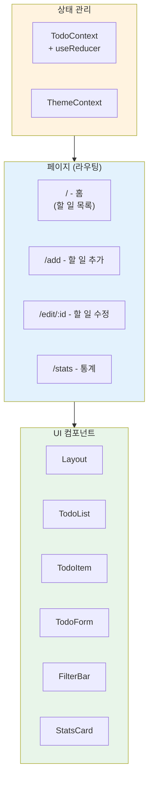
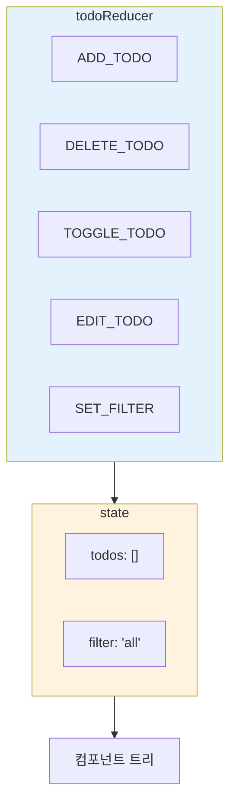
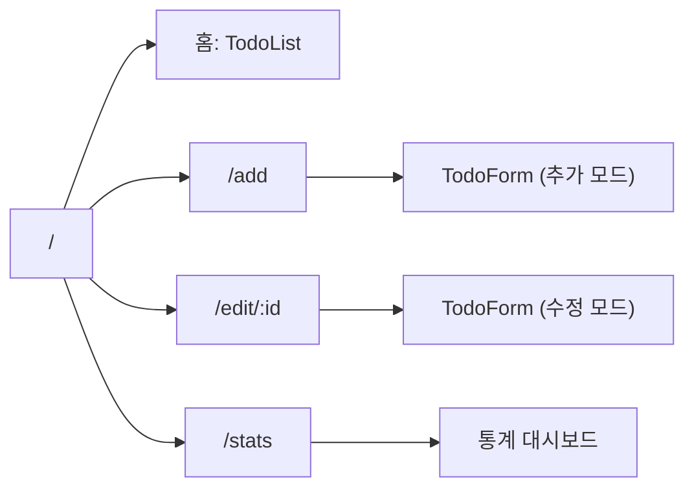
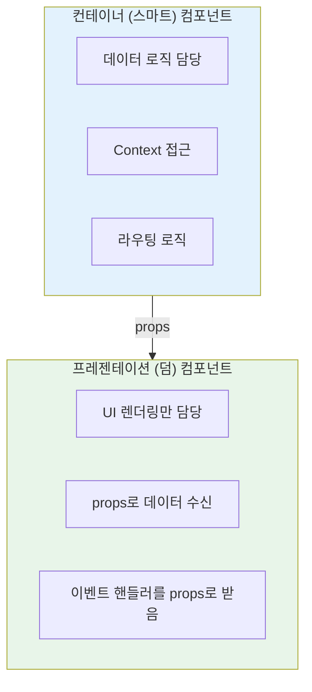
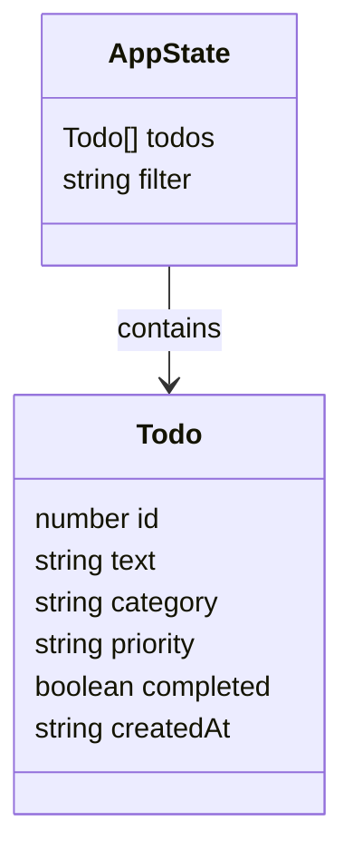

# 챕터 10: 실전 프로젝트 - 할 일 관리 앱

> **난이도**: ⭐⭐⭐ (3/5)
> **예상 학습 시간**: 4시간
> **선수 지식**: 챕터 06~09 전체 (폼, useEffect, Context, Router)

---

## 학습 목표

이 챕터를 마치면 다음을 할 수 있습니다:

- CRUD(Create, Read, Update, Delete) 기능을 갖춘 완전한 앱을 구축할 수 있다
- 여러 챕터에서 배운 개념들을 하나의 프로젝트에 통합할 수 있다
- 컴포넌트를 역할에 따라 적절히 분리할 수 있다
- Context + useReducer로 전역 상태를 효율적으로 관리할 수 있다
- React Router로 다중 페이지 앱을 구성할 수 있다

---

## 프로젝트 구조



### 파일 구조 (권장)

```
src/
├── App.jsx              # 라우팅 설정
├── contexts/
│   ├── TodoContext.jsx   # 할 일 상태 관리
│   └── ThemeContext.jsx  # 테마 상태 관리
├── components/
│   ├── Layout.jsx        # 공통 레이아웃
│   ├── TodoList.jsx      # 할 일 목록
│   ├── TodoItem.jsx      # 개별 할 일 항목
│   ├── TodoForm.jsx      # 추가/수정 폼
│   ├── FilterBar.jsx     # 필터 바
│   └── StatsCard.jsx     # 통계 카드
└── pages/
    ├── HomePage.jsx      # 홈 (목록)
    ├── AddPage.jsx       # 추가 페이지
    ├── EditPage.jsx      # 수정 페이지
    └── StatsPage.jsx     # 통계 페이지
```

---

## 핵심 개념 통합

### 1. 상태 관리: Context + useReducer

할 일 데이터는 앱 전체에서 공유되어야 하므로 Context를 사용합니다. 여러 종류의 상태 변경(추가, 삭제, 수정, 완료 토글)이 있으므로 useReducer가 적합합니다.



```jsx
// 할 일 리듀서
function todoReducer(state, action) {
  switch (action.type) {
    case 'ADD_TODO':
      return {
        ...state,
        todos: [...state.todos, {
          id: Date.now(),
          text: action.payload.text,
          category: action.payload.category,
          priority: action.payload.priority,
          completed: false,
          createdAt: new Date().toISOString(),
        }],
      };

    case 'DELETE_TODO':
      return {
        ...state,
        todos: state.todos.filter(todo => todo.id !== action.payload),
      };

    case 'TOGGLE_TODO':
      return {
        ...state,
        todos: state.todos.map(todo =>
          todo.id === action.payload
            ? { ...todo, completed: !todo.completed }
            : todo
        ),
      };

    case 'EDIT_TODO':
      return {
        ...state,
        todos: state.todos.map(todo =>
          todo.id === action.payload.id
            ? { ...todo, ...action.payload.updates }
            : todo
        ),
      };

    case 'SET_FILTER':
      return { ...state, filter: action.payload };

    default:
      return state;
  }
}
```

### 2. 라우팅 구조



### 3. 컴포넌트 분리 원칙



### 4. 로컬 스토리지 연동

```jsx
// 초기 state를 로컬 스토리지에서 복원
const initialState = {
  todos: JSON.parse(localStorage.getItem('todos') || '[]'),
  filter: 'all',
};

// todos가 변경될 때마다 로컬 스토리지에 저장
useEffect(() => {
  localStorage.setItem('todos', JSON.stringify(state.todos));
}, [state.todos]);
```

### 5. 데이터 모델



각 할 일 항목의 구조:

```js
{
  id: 1704067200000,           // 고유 ID (타임스탬프)
  text: '리액트 공부하기',       // 할 일 내용
  category: '학습',             // 카테고리 (학습/업무/생활/기타)
  priority: 'high',            // 우선순위 (high/medium/low)
  completed: false,            // 완료 여부
  createdAt: '2024-01-01T00:00:00.000Z'  // 생성 시간
}
```

---

## 코드로 이해하기

### 예제 1: 완성형 할 일 관리 앱
> 📁 `practice/example-01.jsx` 파일을 참고하세요.

이 예제는 지금까지 배운 모든 개념을 활용한 완성형 프로젝트입니다:

```jsx
// 핵심 아키텍처:
// 1. TodoContext + useReducer = 전역 상태 관리
// 2. BrowserRouter + Routes = 페이지 라우팅
// 3. 제어 컴포넌트 = 폼 처리
// 4. useEffect = 로컬 스토리지 동기화
// 5. 컴포넌트 분리 = 재사용성과 유지보수성
```

**실행 방법**:
```bash
npx create-react-app todo-app
cd todo-app
npm install react-router-dom
# src/App.js에 example-01.jsx 내용을 복사
npm start
```

**예상 출력**: 할 일 CRUD, 필터링, 통계, 다크 모드를 갖춘 완성형 할 일 관리 앱이 표시됩니다.

---

## 주의 사항

- ⚠️ **상태 불변성 유지**: 리듀서에서 state를 직접 변경하지 말고 항상 새 객체를 반환하세요 (`...spread` 사용).
- ⚠️ **컴포넌트 과분리 주의**: 너무 잘게 나누면 오히려 복잡해집니다. 재사용되거나 로직이 복잡한 부분만 분리하세요.
- ⚠️ **key 속성**: 목록 렌더링 시 고유한 `key`를 반드시 지정하세요. 배열 인덱스보다 고유 ID를 사용하는 것이 좋습니다.
- 💡 **팁**: 먼저 정적 UI를 만들고, 그 다음 상태 관리를 추가하고, 마지막에 라우팅을 연결하는 순서로 개발하면 효율적입니다.
- 💡 **팁**: `console.log`로 리듀서 액션과 상태 변화를 추적하면 디버깅이 쉬워집니다.

---

## 정리

| 통합 개념 | 사용 목적 | 해당 챕터 |
|-----------|----------|----------|
| useState | 폼 입력값, UI 상태 관리 | 챕터 03~04 |
| useEffect | 로컬 스토리지 동기화, 문서 타이틀 업데이트 | 챕터 07 |
| useRef | 폼 포커스 관리 | 챕터 06 |
| Context + useReducer | 전역 할 일 상태 관리 | 챕터 08 |
| React Router | 페이지 라우팅 (목록, 추가, 수정, 통계) | 챕터 09 |
| 제어 컴포넌트 | 할 일 추가/수정 폼 | 챕터 06 |
| 컴포넌트 분리 | 재사용 가능한 UI 구성 | 챕터 04~05 |

---

## 다음 단계

- ✅ `practice/exercise.md`의 5개 연습 문제를 풀어보세요.
- 📖 **추가 학습 추천**:
  - 커스텀 훅 만들기
  - 성능 최적화 (React.memo, useMemo, useCallback)
  - 외부 상태 관리 라이브러리 (Zustand, Redux Toolkit)
  - 서버 상태 관리 (TanStack Query / React Query)
  - TypeScript와 React
- 🔗 참고 자료:
  - [React 공식 문서](https://react.dev)
  - [React Router 공식 문서](https://reactrouter.com)
  - [Thinking in React](https://react.dev/learn/thinking-in-react)
